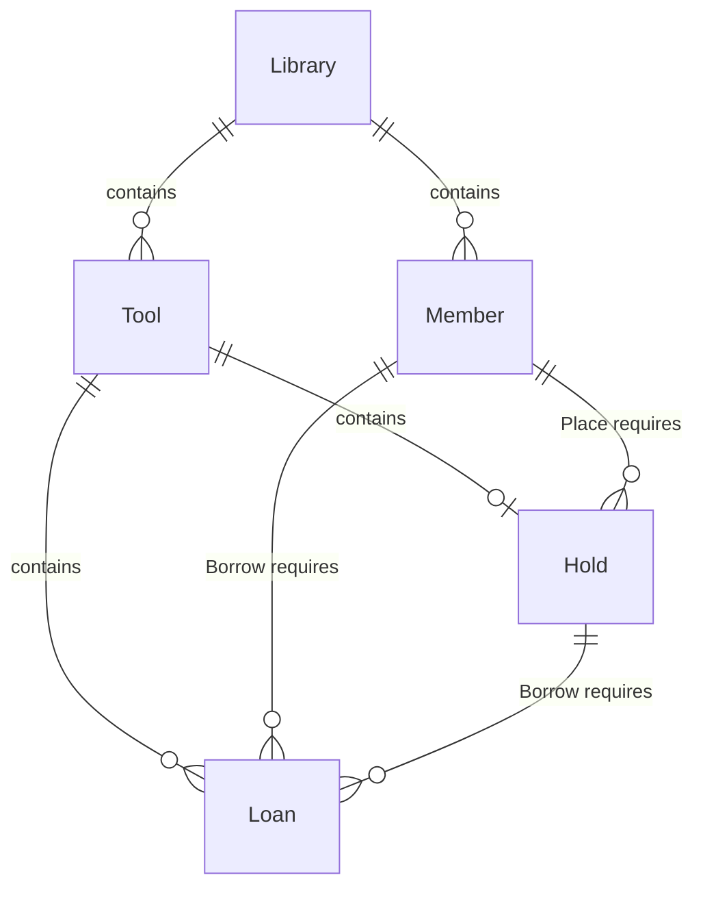
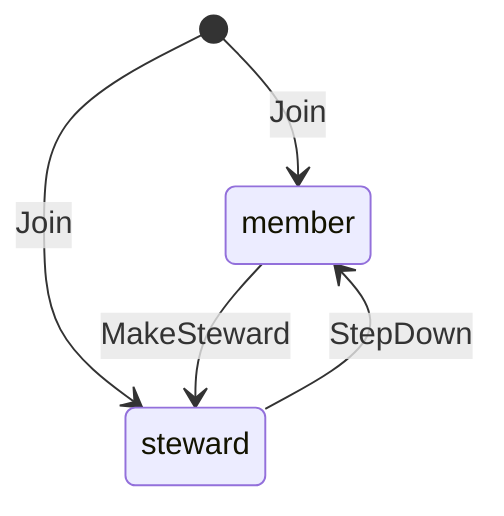
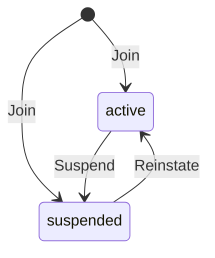
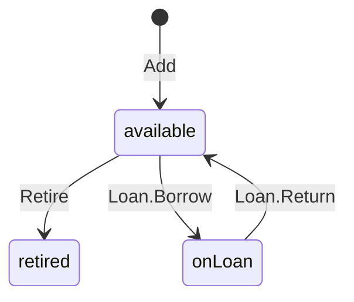
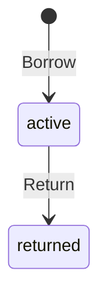
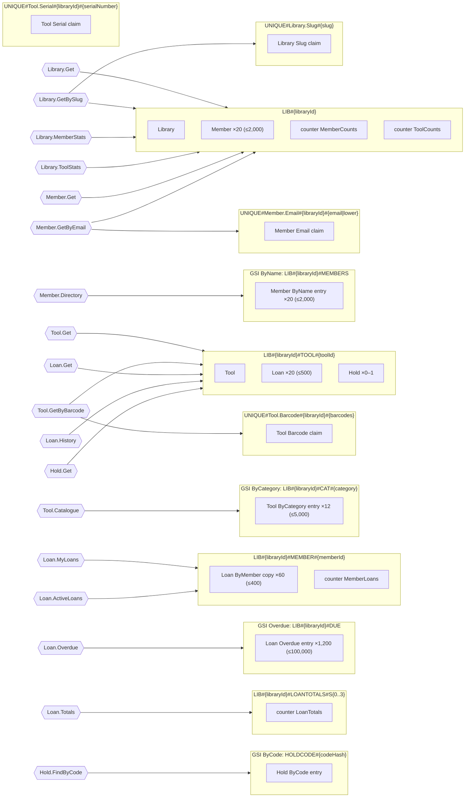
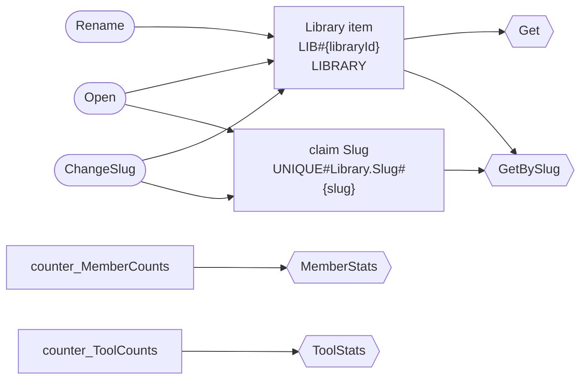
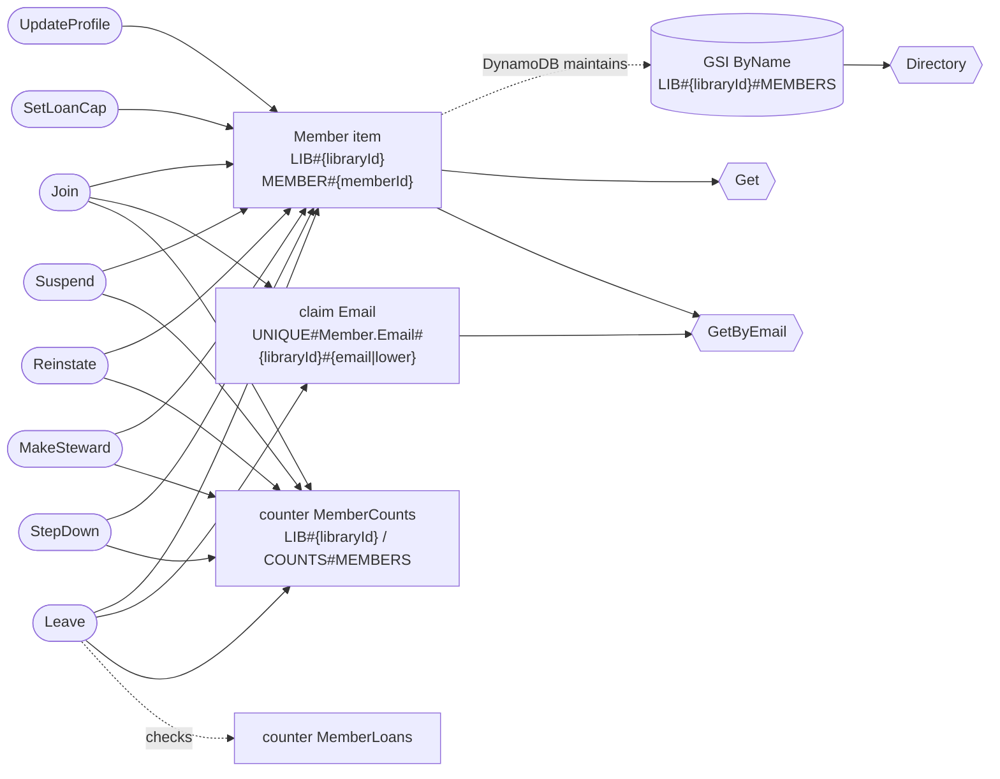
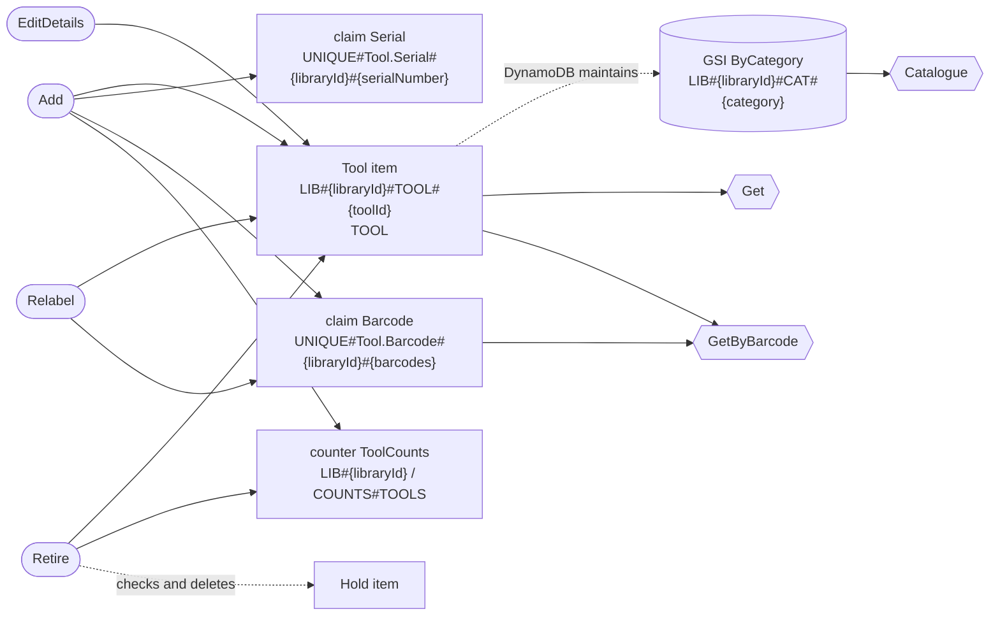
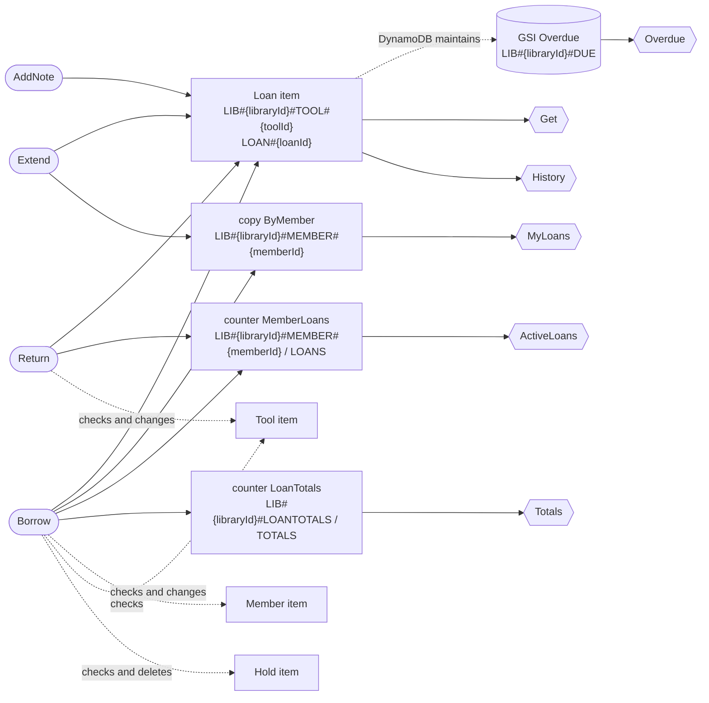

# `toollibrary` data model

> Generated by dynago from `toollibrary.dynago.yaml`. Do not edit: change the schema and run `dynago generate`.

Libraries, their members and tools, loans and pickup holds.

Table generation **2**: `toollibrary-g2`. It is filled from generation 1 (`toollibrary-g1`) by the migration job (`RunMigration`); `toollibrary-g1` stays for rollback. See the [migrations guide](https://github.com/nicklanng/dynago/blob/main/docs/guides/migrations.md).

**Contents:** [Summary](#summary) · [Domain](#domain) · [Reads](#reads) · [Writes](#writes) · [Storage and partitions](#storage-and-partitions) · [Risks and costs](#risks-and-costs) · [Reference](#reference) · [How to read this](#how-to-read-this)

## Summary

| | |
|---|---|
| Entities | 5: Library, Member, Tool, Loan, Hold |
| Reads | 18: 5 by key, 3 by unique value, 6 queries, 4 counters |
| Writes | 21: 15 in a transaction, 11 reading the item first |
| Indexes | 4 GSIs, 1 copy index (ByName, ByCategory, Overdue, ByCode, Loan.ByMember) |
| Uniqueness claims, counters | 4, 4 |
| Workload | Volumes expected at 3 years; peak traffic 5× the average; volumes declared for 5 of 5 entities |
| Largest partition | `LIB#{libraryId}#DUE` (GSI Overdue): 420 KB typical, 34 MB at most |
| Busiest partition at peak | `LIB#{libraryId}` (base table): 0.27% of a partition's capacity, risk **low** |
| Storage | 4.0 GB at the declared volumes |
| Cost | $172.25/month at the declared volumes and rates |
| Findings | 0 errors, 1 warning, 0 notes open; 3 accepted |

Open findings (details under [Risks and costs](#risks-and-costs)):

- ⚠️ warning **large-field**, entity Tool: manual (p99 19.5 KB) makes every write cost up to 21 WRU (42 in a transaction), including writes that never change it.

## Domain

### Entities

| Entity | What it is | Identified by | Volume | Expected items |
|---|---|---|---|---|
| [Library](#library) | A tool library, run by volunteers in one neighbourhood. | `libraryId` | 2,000 | 2,000 |
| [Member](#member) | A person who can borrow tools from one library. | `libraryId`, `memberId` | 20 per Library (at most 2,000) | 40,000 |
| [Tool](#tool) | A tool the library lends out. | `libraryId`, `toolId` | 60 per Library (at most 5,000) | 120,000 |
| [Loan](#loan) | A member borrowing a tool. | `libraryId`, `toolId`, `loanId` | 20 per Tool (at most 500) | 2,400,000 |
| [Hold](#hold) | A tool reserved for a member to collect, with a pickup code. | `libraryId`, `toolId` | 0.02 per Tool (at most 1) | 2,400 |

### Relationships

| Entity | Related to | How |
|---|---|---|
| Member | Library | Lives in (or under) its Library's partition, and holds its Library's key in `libraryId`; 20 per Library typically, at most 2,000. |
| Tool | Library | Lives in (or under) its Library's partition, and holds its Library's key in `libraryId`; 60 per Library typically, at most 5,000. |
| Loan | Tool | Lives in (or under) its Tool's partition, and holds its Tool's key in `libraryId`, `toolId`; Borrow, Return require it; 20 per Tool typically, at most 500. |
| Hold | Tool | Lives in (or under) its Tool's partition, and holds its Tool's key in `libraryId`, `toolId`; Place requires it; 0.02 per Tool typically, at most 1. |
| Loan | Member | Holds its Member's key in `libraryId`, `memberId`; Borrow requires it; 60 per Member typically, at most 400. |
| Loan | Hold | Holds its Hold's key in `libraryId`, `toolId`; Borrow requires it. |
| Hold | Member | Holds its Member's key in `libraryId`, `memberId`; Place requires it. |

### Guarantees

What the generated code enforces on every write, so no bug or race elsewhere can break it.

- **Library**
  - No two Libraries have the same slug. *(claim Slug)*
- **Member**
  - No two Members have the same libraryId and email (ignoring case). *(claim Email)*
  - The number of Members with role = "steward" and status = "active" per libraryId never goes below 1. *(counter MemberCounts)*
  - Leave requires counter MemberLoans to have active = 0 (a missing value counts as 0), in one transaction. *(Member.Leave)*
- **Tool**
  - No two Tools have the same libraryId and serialNumber. *(claim Serial)*
  - No element of barcodes appears in two Tools with the same libraryId. *(claim Barcode)*
  - Retire deletes the Hold if there is one, in one transaction. *(Tool.Retire)*
- **Loan**
  - The number of Loans with status = "active" per libraryId and memberId never exceeds the limit its writes are given (Borrow). *(counter MemberLoans)*
  - Every Loan has memberId, borrowedAt and dueAt. *(required fields)*
  - Borrow requires the Member to exist with status = "active"; requires the Tool to exist with status = "available", and sets its status to "onLoan"; requires any Hold to have memberId = Loan.memberId (an absent or expired one passes), and deletes the Hold if there is one, in one transaction. *(Loan.Borrow)*
  - Return requires the Tool to exist with status = "onLoan", and sets its status to "available", in one transaction. *(Loan.Return)*
- **Hold**
  - Every Hold has memberId, codeHash and expiresAt. *(required fields)*
  - Place requires the Tool to exist with status = "available"; requires the Member to exist with status = "active", in one transaction. *(Hold.Place)*

### Lifecycles

How writes move each status-like field between its values. `*` marks a write that doesn't check the current value, or lets the caller choose the new one.

#### Member.role

Join lets the caller choose the first value; Leave deletes it, whatever the value.

#### Member.status

Join lets the caller choose the first value; Leave deletes it, whatever the value.

#### Tool.status

No write moves a Tool out of `retired`.

#### Loan.status

No write moves a Loan out of `returned`.

## Reads

Every read the code can make. A read that isn't listed has no method, so a new way of reading the data can only arrive as a change to the schema, and to this document.

| Read | Answers | Served by | Freshness | Returns | RRU per call p50/p99 | Rate |
|---|---|---|---|---|---|---|
| `Library.Get` | One Library, by libraryId. | GetItem | eventual (not stated) | one | 0.5 | 5/s |
| `Library.GetBySlug` | The Library holding a slug. | claim Slug, then the item (2 GetItems) | strong (not stated) | one | 2 | 20/s |
| `Library.MemberStats` | The member counts, read from the library's page. | counter MemberCounts (GetItem) | eventual (not stated) | the counts | 0.5 | 2/s |
| `Library.ToolStats` | The ToolCounts counts for a libraryId. | counter ToolCounts (GetItem) | eventual (not stated) | the counts | 0.5 | 2/s |
| `Member.Get` | One Member, by libraryId and memberId. | GetItem | eventual (not stated) | one | 0.5 | 10/s |
| `Member.GetByEmail` | The Member holding a libraryId and email. | claim Email, then the item (2 GetItems) | strong (not stated) | one | 2 | 1/s |
| `Member.Directory` | Members with a given libraryId, by name (ascending). | Query of GSI ByName | eventual | 20 items typically, 2,000 at most: 1–40 pages of 50 | 2 / 4 | 2/s |
| `Tool.Get` | One Tool, by libraryId and toolId. | GetItem | eventual (not stated) | one | 0.5 / 3 | 20/s |
| `Tool.Catalogue` | Tools with a given libraryId and category, by name (ascending). | Query of GSI ByCategory | eventual | 12 items typically, 5,000 at most: 1–200 pages of 25 | 1 / 2.5 | 10/s |
| `Tool.GetByBarcode` | The Tool holding an element of barcodes. | claim Barcode, then the item (2 GetItems) | strong (not stated) | one | 2 / 7 | 2/s |
| `Loan.Get` | One Loan, by libraryId, toolId and loanId. | GetItem | eventual (not stated) | one | 0.5 | — |
| `Loan.History` | A tool's loans, newest first, without the notes. | Query of the Loan's partition | eventual (not stated) | 20 items typically, 500 at most: 1–25 pages of 20 | 1.5 / 5 | 1/s |
| `Loan.MyLoans` | A member's current loans, soonest due first. | Query of copy ByMember | immediate | 60 items typically, 400 at most (fewer: only those matching the index's where): 2–8 pages of 50 | 5 / 10 | 5/s |
| `Loan.Overdue` | Loans with a given libraryId, by dueAt (ascending). | Query of GSI Overdue | eventual | 1,200 items typically, 100,000 at most (fewer: only those matching the index's where): 24–2,000 pages of 50 | 2.5 / 5 | 0.01/s |
| `Loan.ActiveLoans` | The MemberLoans counts for a libraryId and memberId. | counter MemberLoans (GetItem) | eventual (not stated) | the counts | 0.5 | — |
| `Loan.Totals` | The LoanTotals counts for a libraryId. | counter LoanTotals (4 shards, one BatchGetItem) | eventual (not stated) | the counts | 2 | — |
| `Hold.Get` | One Hold, by libraryId and toolId. | GetItem | eventual (not stated) | one | 0.5 | — |
| `Hold.FindByCode` | Holds with a given codeHash. | Query of GSI ByCode | eventual | pages of 1, a page at a time (volume not declared) | 0.5 | 1/s |

## Writes

Every write the code can make, and everything each changes. Each is atomic: all of it happens, or none of it does.

| Write | Does | Checks | Changes | Reads first | Atomic | WRU per call p50/p99 | Rate |
|---|---|---|---|---|---|---|---|
| `Library.Open` | Creates a Library | no Library at the key; slug unique (claim Slug) | Library claim Slug | no | transaction, 2 items | 4 | — |
| `Library.Rename` | Sets `name` if given | the Library exists; the caller's version is current | Library | no | single item | 1 | — |
| `Library.ChangeSlug` | Sets `slug` | the Library exists; slug unique (claim Slug); the caller's version is current | Library claim Slug (moved: put + delete) | yes | transaction, 3 items | 6 | — |
| `Member.Join` | Creates a Member | no Member at the key; libraryId and email unique (claim Email) | Member GSI ByName entry counter MemberCounts claim Email | no | transaction, 3 items | 7 | — |
| `Member.UpdateProfile` | Sets `name` if given, sets `phone` if given | the Member exists | Member GSI ByName entry (moved: delete + put) | yes | single item | 3 | — |
| `Member.SetLoanCap` | Sets `maxLoans` | the Member exists | Member | no | single item | 1 | — |
| `Member.Suspend` | Sets `status` = "suspended" | the Member exists; status = "active"; MemberCounts.stewards stays at least 1 | Member GSI ByName entry counter MemberCounts | yes | transaction, 2 items | 5 | — |
| `Member.Reinstate` | Sets `status` = "active" | the Member exists; status = "suspended"; MemberCounts.stewards stays at least 1 | Member GSI ByName entry counter MemberCounts | yes | transaction, 2 items | 5 | — |
| `Member.MakeSteward` | Sets `role` = "steward" | the Member exists; role = "member"; MemberCounts.stewards stays at least 1 | Member GSI ByName entry counter MemberCounts | yes | transaction, 2 items | 5 | — |
| `Member.StepDown` | Sets `role` = "member" | the Member exists; role = "steward"; MemberCounts.stewards stays at least 1 | Member GSI ByName entry counter MemberCounts | yes | transaction, 2 items | 5 | — |
| `Member.Leave` | Deletes a Member | the Member exists; counter MemberLoans has active = 0; MemberCounts.stewards stays at least 1 | Member GSI ByName entry counter MemberCounts claim Email check counter MemberLoans | yes | transaction, 4 items | 9 | — |
| `Tool.Add` | Creates a Tool, sets `status` = "available" | no Tool at the key; libraryId and serialNumber unique (claim Serial); libraryId and barcodes unique (claim Barcode) | Tool GSI ByCategory entry counter ToolCounts claim Serial claims Barcode (one per barcodes element) | no | transaction, 6 items | 13 / 53 | — |
| `Tool.EditDetails` | Sets `name` if given, sets `manual` if given, sets `tags` if given | the Tool exists; the caller's version is current | Tool GSI ByCategory entry (moved: delete + put) | yes | single item | 5 / 23 | — |
| `Tool.Relabel` | Sets `barcodes` | the Tool exists; libraryId and barcodes unique (claim Barcode) | Tool claims Barcode (added and dropped barcodes elements) | yes | transaction, 7 items | 10 / 54 | — |
| `Tool.Retire` | Sets `status` = "retired", deletes the Hold if there is one | the Tool exists; status = "available" | Tool GSI ByCategory entry counter ToolCounts Hold (deletes the Hold if there is one) Hold's GSI ByCode entry | no (read-free) | transaction, 3 items | 12 / 48 | — |
| `Loan.Borrow` | Creates a Loan, sets `status` = "active", sets the Tool's status to "onLoan", deletes the Hold if there is one | no Loan at the key; the Member exists with status = "active"; the Tool exists with status = "available"; any Hold has memberId = Loan.memberId (none is fine); MemberLoans.active stays within the caller's limit; required fields are set | Loan copy ByMember GSI Overdue entry counter MemberLoans counter LoanTotals check Member Tool (sets its status to "onLoan") Tool's GSI ByCategory entry Tool's counter ToolCounts Hold (deletes the Hold if there is one) Hold's GSI ByCode entry | no | transaction, 8 items | 23 / 61 | 2/s |
| `Loan.Return` | Sets `returnedAt`, sets `status` = "returned", sets the Tool's status to "available" | the Loan exists; status = "active"; the Tool exists with status = "onLoan" | Loan copy ByMember (moved: put + delete) GSI Overdue entry (moved: delete + put) counter MemberLoans Tool (sets its status to "available") Tool's GSI ByCategory entry Tool's counter ToolCounts | yes | transaction, 6 items | 19 / 57 | 2/s |
| `Loan.Extend` | Sets `dueAt` | the Loan exists; status = "active"; required fields are set | Loan copy ByMember (moved: put + delete) GSI Overdue entry (moved: delete + put) | yes | transaction, 3 items | 8 / 10 | — |
| `Loan.AddNote` | Sets `notes` if given | the Loan exists | Loan | no | single item | 1 / 2 | — |
| `Hold.Place` | Creates a Hold | no Hold at the key; the Tool exists with status = "available"; the Member exists with status = "active"; required fields are set | Hold GSI ByCode entry check Tool check Member | no | transaction, 3 items | 11 / 47 | — |
| `Hold.Release` | Deletes a Hold | the Hold exists | Hold GSI ByCode entry | no | single item | 2 | — |

## Storage and partitions

### Table

| Setting | Value |
|---|---|
| Table | `toollibrary-g2` (generation 2) |
| Base key | `PK` (partition, string) + `SK` (sort, string) |
| Billing | On-demand |
| TTL attribute | `ttl` (epoch seconds) |

### Indexes

A GSI is maintained by DynamoDB a moment after each write: writes stay cheap, and reads are eventually consistent. A copy is written by the generated code in the write's transaction: writes that change it cost a transaction, and reads see them immediately.

| Index | Kind | Keys | Projection | Read by | Why this kind | The other kind |
|---|---|---|---|---|---|---|
| `Member.ByName` | GSI `ByName` | `LIB#{libraryId}#MEMBERS` / `{name\|lower}#{memberId}` | `role`, `status` plus key fields | Directory | chosen: no read through it needs immediate freshness | Can't be a copy: a copy's sort key must start with literal text, and ByName's starts with a field. |
| `Tool.ByCategory` | GSI `ByCategory` | `LIB#{libraryId}#CAT#{category}` / `{name\|lower}#{toolId}` | `status`, `tags` plus key fields | Catalogue | chosen: no read through it needs immediate freshness | Can't be a copy: a copy's sort key must start with literal text, and ByCategory's starts with a field. |
| `Loan.ByMember` | copy | `LIB#{libraryId}#MEMBER#{memberId}` / `MYLOAN#{dueAt}#{toolId}#{loanId}`; only when `status = "active"` | `toolName`, `dueAt` plus key fields | MyLoans | chosen: MyLoans needs immediate freshness | As a GSI: Loan.Borrow 23 → 22 WRU (8 → 7 items); Loan.Return 19 → 17 WRU (6 → 4 items); Loan.Extend 8 → 5 WRU, no longer a transaction; MyLoans would lose immediate freshness. |
| `Loan.Overdue` | GSI `Overdue` | `LIB#{libraryId}#DUE` / `{dueAt}#{loanId}`; only when `status = "active"` | `memberId`, `toolName` plus key fields | Overdue | chosen: no read through it needs immediate freshness | Can't be a copy: a copy's sort key must start with literal text, and Overdue's starts with a field. |
| `Hold.ByCode` | GSI `ByCode` | `HOLDCODE#{codeHash}` | `memberId`, `expiresAt` plus key fields | FindByCode | chosen: no read through it needs immediate freshness | Can't be a copy: a copy needs a sort key, and ByCode has none. |

### Partition map

Which items share a partition, in the base table and in each GSI, and which reads reach them.

### Partitions

Each row is every partition key value one key pattern renders: *Keys* is how many values there are. Counts are per value: typical, then the largest. Traffic is the busiest value's at peak.

| Partition key | In | Keys | Holds | Size, typical / largest | Grows | Busiest key at peak | Risk |
|---|---|---|---|---|---|---|---|
| `LIB#{libraryId}` | base table | 2,000 | Library: 1 Member: 20 / 2,000 counter MemberCounts: 1 counter ToolCounts: 1 | 9 KB / 870 KB | no | 2.67 WRU/s, 2.01 RRU/s | low (0.27%) |
| `UNIQUE#Library.Slug#{slug}` | base table | 2,000 | Library Slug claim: 1 | 230 B / 230 B | no | 0 WRU/s, 0.05 RRU/s | low (<0.01%) |
| `LIB#{libraryId}#MEMBERS` | GSI ByName | 2,000 | Member ByName entry: 20 / 2,000 | 5 KB / 494 KB | no | 0 WRU/s, 1 RRU/s | low (0.03%) |
| `UNIQUE#Member.Email#{libraryId}#{email\|lower}` | base table | 40,000 | Member Email claim: 1 | 230 B / 230 B | no | 0 WRU/s, <0.01 RRU/s | low (<0.01%) |
| `LIB#{libraryId}#TOOL#{toolId}` | base table | 120,000 | Tool: 1 Loan: 20 / 500 Hold: 0 or 1 | 13 KB / 267 KB | yes: Loan never removed | 0.02 WRU/s, <0.01 RRU/s | low (<0.01%) |
| `LIB#{libraryId}#CAT#{category}` | GSI ByCategory | 10,000 | Tool ByCategory entry: 12 / 5,000 | 4 KB / 1 MB | yes: Tool never removed | 0.83 WRU/s, 2.08 RRU/s | low (0.08%) |
| `UNIQUE#Tool.Serial#{libraryId}#{serialNumber}` | base table | 120,000 | Tool Serial claim: 1 | 230 B / 230 B | no | no rates declared | — |
| `UNIQUE#Tool.Barcode#{libraryId}#{barcodes}` | base table | 120,000 | Tool Barcode claim: 1 | 230 B / 230 B | no | 0 WRU/s, <0.01 RRU/s | low (<0.01%) |
| `LIB#{libraryId}#MEMBER#{memberId}` | base table | 40,000 | Loan ByMember copy: 60 / 400 counter MemberLoans: 1 | 23 KB / 154 KB | no | 0.02 WRU/s, 0.02 RRU/s | low (<0.01%) |
| `LIB#{libraryId}#DUE` | GSI Overdue | 2,000 | Loan Overdue entry: 1,200 / 100,000 | 420 KB / 34 MB | no | 1.25 WRU/s, <0.01 RRU/s | low (0.12%) |
| `LIB#{libraryId}#LOANTOTALS#S{0..3}` | base table | 2,000 | counter LoanTotals: 1 | 148 B / 148 B | no | 0.21 WRU/s, 0 RRU/s | low (0.02%) |
| `HOLDCODE#{codeHash}` | GSI ByCode | unknown | Hold ByCode entry: unknown | unknown / unknown | no | no rates declared | — |

Unknown counts: nothing declares how many items share a value of `codeHash` in `HOLDCODE#{codeHash}`. For a field that identifies another entity, name it (`ref:`, or a matching field name) and give the spread (`volume.by`).

## Risks and costs

| | Rule | About | Finding |
|---|---|---|---|
| ⚠️ warning | `large-field` | entity Tool | manual (p99 19.5 KB) makes every write cost up to 21 WRU (42 in a transaction), including writes that never change it: Relabel, Retire, Loan.Borrow, Loan.Return. Consider moving it to an entity of its own, written only when it changes. |

### Accepted

Findings the schema records as deliberate, with its reasons.

| Rule | About | Finding | Reason |
|---|---|---|---|
| `sparse-index` | index Member.ByName | is keyed by name, which is optional: a Member without one is missing from ByName and from Directory, with nothing to say so. Make the field required, or accept this if it's deliberate. | Members invited by email join without a name, and stay out of the directory until they give one. |
| `sparse-index` | index Tool.ByCategory | is keyed by category and name, which are optional: a Tool without them is missing from ByCategory and from Catalogue, with nothing to say so. Make the field required, or accept this if it's deliberate. | Donated tools are added before a steward sorts them; they join the catalogue once they have a category. |
| `unenforced-unique` | index Hold.ByCode | FindByCode reads one entry of ByCode, keyed by codeHash, as if the key were unique, but no unique constraint makes it so: two Holds with the same codeHash would both be there, and the read returns either. Declare unique: on the fields, or accept this if duplicates can't happen. | Codes are HMACs under a server-side secret: two holds sharing one is negligibly unlikely, and a claim would outlive the hold's TTL. |

### Costs

| Entity | Expected items | Item p50/p99 | Storage incl. indexes | Storage $/month | Throughput $/month at declared rates |
|---|---|---|---|---|---|
| Library | 2,000 | 238 B / 421 B | 0.00 GB | $0.00 | $14.42 |
| Member | 40,000 | 445 B / 908 B | 0.05 GB | $0.01 | $3.56 |
| Tool | 120,000 | 2.4 KB / 20.5 KB | 0.41 GB | $0.10 | $7.78 |
| Loan | 2,400,000 | 540 B / 1.9 KB | 3.56 GB | $0.89 | $145.32 |
| Hold | 2,400 | 474 B / 706 B | 0.00 GB | $0.00 | $0.16 |

Estimated total: **$172.25/month** for the declared volumes and rates.

Assumptions:

- Volumes describe the table at 3 years (workload.horizon).
- Peak traffic is 5× the declared average rates (workload.peak).
- Items per partition follow the volumes: an entity's items per parent (typical and max), multiplied up the parents. A partition's largest count takes the biggest skew along its path, not every one at once.
- An enum in a partition key splits the items evenly among its values typically; at worst they all share one. A field that refers to another entity (by name, ref or requires) spreads the items evenly over that entity's items, unless volume.by says otherwise. Any other field leaves the count unknown.
- Index entries are counted as if every item had one: `where` and empty key fields only make an index smaller.
- The busiest partition gets traffic in proportion to its share of the items: its largest count over the entity's total. A write's declared hot_key_rate replaces that estimate for every partition it touches.
- A partition key value takes at most 1000 WRU and 3000 RRU per second. Risk is the larger share of either at peak: low under 10%, medium under 50%, high above.
- Sizes use each field's declared size (p50/p99); undeclared sizes use type defaults (string 20/64 B, time 30/35 B, int 8/11 B).
- Every declared field is assumed present; empty fields are not stored, so real items are usually smaller.
- A unique string set makes one claim per element; the number of elements is estimated from the set's declared size at 20 B per element.
- Capacity follows DynamoDB rules: 1 WRU per started 1 KB written, 1 RRU per started 4 KB read strongly (half for eventually consistent); transactions cost double, and a condition check on another item is billed as a transactional write of that item.
- GSI and copy writes are counted as one index write per entry; an index key change is a delete plus a put.
- Prices: $0.625 per million WRU, $0.125 per million RRU, $0.25 per GB-month (on-demand).
- Monthly figures use each access pattern's and write's declared average rate (rate:, per second); patterns without a rate are not costed.
- Storage counts each entity's items, index entries and claims at its declared volume, plus 100 bytes of overhead per item. A scan reads the base table's items, copies and claims, without GSI entries or overhead; counter items aren't counted.

## Reference

Each entity in full: its fields, every item stored for it, the key condition of each read, and the errors each write returns.

### Library

A tool library, run by volunteers in one neighbourhood.

Schema version **1**. Go type `Library`, store `Store.Libraries`.

Writes on the left, reads on the right. Dotted arrows are maintained by DynamoDB; solid arrows are written by the generated code.

#### Fields

| Field | Type | Attribute | Size p50/p99 | Notes |
|---|---|---|---|---|
| `libraryId` | string | `libraryId` | 20 / 64 B | key |
| `name` | string | `name` | 20 / 80 B |  |
| `slug` | string | `slug` | 12 / 40 B | The library's URL name. |
| `openedAt` | time | `openedAt` | 30 / 35 B |  |

#### Stored items

Every item that exists because of a Library, and what keeps it up to date.

| Item | Partition key | Sort key | Example | Size p50/p99 | Maintained by |
|---|---|---|---|---|---|
| **Library** | `LIB#{libraryId}` | `LIBRARY` | `LIB#lib_1` `LIBRARY` | 238 B / 421 B | the writes below |
| Claim `Slug` | `UNIQUE#Library.Slug#{slug}` | `UNIQUE` | `UNIQUE#Library.Slug#greenwood` `UNIQUE` | ~230 B each | the writes below, in the same transaction; a conditional put makes `slug` unique. |

#### Uniqueness

- **Slug**: no two Library items share `slug`. Routes /l/{slug} to its library. Global, because the URL carries nothing else.

#### Access patterns

| Method | Reads | Key condition | Consistency | Requests | RRU per call p50/p99 |
|---|---|---|---|---|---|
| `Get` | item by key | `PK = LIB#{libraryId}`, `SK = LIBRARY` | eventual | GetItem | 0.5 |
| `GetBySlug` | claim `Slug`, then the item | `PK = UNIQUE#Library.Slug#{slug}` | strong | GetItem (claim) → GetItem | 2 |
| `MemberStats` | counter `MemberCounts` | `PK = LIB#{libraryId}`, `SK = COUNTS#MEMBERS` | eventual | GetItem | 0.5 |
| `ToolStats` | counter `ToolCounts` | `PK = LIB#{libraryId}`, `SK = COUNTS#TOOLS` | eventual | GetItem | 0.5 |

- `MemberStats`: The member counts, read from the library's page.

#### Writes

| Method | Does | Items written | Reads first | Atomic | Version check | WRU per call p50/p99 | Fails with |
|---|---|---|---|---|---|---|---|
| `Open` | create (fails if it exists) | Library claim Slug | no | transaction (2 items) | — | 4 | `ErrLibraryExists` `ErrLibrarySlugTaken` |
| `Rename` | set `name` if given | Library | no | single item | **required** | 1 | `ErrLibraryNotFound` `dynago.ErrVersionMismatch` (with a version) `dynago.ErrVersionRequired` |
| `ChangeSlug` | set `slug` | Library claim Slug (moved: put + delete) | yes (1 consistent read; none with `dynago.From`) | transaction (3 items) | **required** | 6 | `ErrLibraryNotFound` `ErrLibrarySlugTaken` `dynago.ErrVersionMismatch` (with a version) `dynago.ErrVersionRequired` `dynago.ErrConflict` (after retries) |

- `Rename`: A steward editing the library's settings.

### Member

A person who can borrow tools from one library.

Schema version **1**. Go type `Member`, store `Store.Members`.

Writes on the left, reads on the right. Dotted arrows are maintained by DynamoDB; solid arrows are written by the generated code.

#### Fields

| Field | Type | Attribute | Size p50/p99 | Notes |
|---|---|---|---|---|
| `libraryId` | string | `libraryId` | 20 / 64 B | key |
| `memberId` | string | `memberId` | 20 / 64 B | key |
| `email` | string | `email` | 25 / 80 B | Stored as given; matched case-insensitively. |
| `name` | string | `name` | 15 / 60 B |  |
| `phone` | string | `phone` | 20 / 64 B |  |
| `role` | enum: member, steward | `role` | 7 / 7 B |  |
| `status` | enum: active, suspended | `status` | 9 / 9 B |  |
| `maxLoans` | int | `maxLoans` | 8 / 11 B | How many tools the member may have out at once. |
| `joinedAt` | time | `joinedAt` | 30 / 35 B |  |

#### Stored items

Every item that exists because of a Member, and what keeps it up to date.

| Item | Partition key | Sort key | Example | Size p50/p99 | Maintained by |
|---|---|---|---|---|---|
| **Member** | `LIB#{libraryId}` | `MEMBER#{memberId}` | `LIB#lib_1` `MEMBER#m_7` | 445 B / 908 B | the writes below |
| GSI `ByName` entry | `LIB#{libraryId}#MEMBERS` | `{name|lower}#{memberId}` | `LIB#lib_1#MEMBERS` `{name}#m_7` | 253 B / 607 B | DynamoDB, from the item's `ByNamePK`/`ByNameSK` attributes (eventually consistent). Sparse: absent when a key field is empty. |
| Claim `Email` | `UNIQUE#Member.Email#{libraryId}#{email|lower}` | `UNIQUE` | `UNIQUE#Member.Email#lib_1#{email}` `UNIQUE` | ~230 B each | the writes below, in the same transaction; a conditional put makes `libraryId`, `email` unique. |
| Counter `MemberCounts` | `LIB#{libraryId}` | `COUNTS#MEMBERS` | `LIB#lib_1` `COUNTS#MEMBERS` | ~179 B | the writes below, with atomic ADDs in the same transaction. |

#### Indexes

- **ByName** (global secondary index, maintained by DynamoDB, eventually consistent; chosen because no read through it needs immediate freshness). The member directory, alphabetical. Lower-cased in the key, so "adam" sorts before "Zoe". Projection: `role`, `status` plus key fields.

#### Counters

- **MemberCounts**, keyed by `libraryId`. Holds the library's member numbers.
  - `active`: count of items where `status = "active"`.
  - `suspended`: count of items where `status = "suspended"`.
  - `stewards`: count of items where `role = "steward"` and `status = "active"`; never goes below 1. A library always keeps at least one active steward.

#### Uniqueness

- **Email**: no two Member items share `libraryId`, `email`. One membership per email address in each library, ignoring case.

#### Access patterns

| Method | Reads | Key condition | Consistency | Requests | RRU per call p50/p99 |
|---|---|---|---|---|---|
| `Get` | item by key | `PK = LIB#{libraryId}`, `SK = MEMBER#{memberId}` | eventual | GetItem | 0.5 |
| `GetByEmail` | claim `Email`, then the item | `PK = UNIQUE#Member.Email#{libraryId}#{email\|lower}` | strong | GetItem (claim) → GetItem | 2 |
| `Directory` | GSI `ByName`, page 50 (max 100) | `ByNamePK = LIB#{libraryId}#MEMBERS`, ascending | eventual (GSI) | Query | 2 / 4 |

#### Writes

| Method | Does | Items written | Reads first | Atomic | Version check | WRU per call p50/p99 | Fails with |
|---|---|---|---|---|---|---|---|
| `Join` | create (fails if it exists) | Member GSI ByName entry counter MemberCounts claim Email | no | transaction (3 items) | — | 7 | `ErrMemberExists` `ErrMemberEmailTaken` |
| `UpdateProfile` | set `name` if given, set `phone` if given | Member GSI ByName entry (moved: delete + put) | yes (1 consistent read; none with `dynago.From`) | single item | optional | 3 | `ErrMemberNotFound` `dynago.ErrVersionMismatch` (with a version) `dynago.ErrConflict` (after retries) |
| `SetLoanCap` | set `maxLoans` | Member | no | single item | optional | 1 | `ErrMemberNotFound` `dynago.ErrVersionMismatch` (with a version) |
| `Suspend` | set `status` = "suspended" when `status = "active"` | Member GSI ByName entry counter MemberCounts | yes (1 consistent read; none with `dynago.From`) | transaction (2 items) | optional | 5 | `ErrMemberNotFound` `ErrMemberSuspendPrecondition` `ErrMemberCountsStewardsMin` `dynago.ErrVersionMismatch` (with a version) `dynago.ErrConflict` (after retries) |
| `Reinstate` | set `status` = "active" when `status = "suspended"` | Member GSI ByName entry counter MemberCounts | yes (1 consistent read; none with `dynago.From`) | transaction (2 items) | optional | 5 | `ErrMemberNotFound` `ErrMemberReinstatePrecondition` `ErrMemberCountsStewardsMin` `dynago.ErrVersionMismatch` (with a version) `dynago.ErrConflict` (after retries) |
| `MakeSteward` | set `role` = "steward" when `role = "member"` | Member GSI ByName entry counter MemberCounts | yes (1 consistent read; none with `dynago.From`) | transaction (2 items) | optional | 5 | `ErrMemberNotFound` `ErrMemberMakeStewardPrecondition` `ErrMemberCountsStewardsMin` `dynago.ErrVersionMismatch` (with a version) `dynago.ErrConflict` (after retries) |
| `StepDown` | set `role` = "member" when `role = "steward"` | Member GSI ByName entry counter MemberCounts | yes (1 consistent read; none with `dynago.From`) | transaction (2 items) | optional | 5 | `ErrMemberNotFound` `ErrMemberStepDownPrecondition` `ErrMemberCountsStewardsMin` `dynago.ErrVersionMismatch` (with a version) `dynago.ErrConflict` (after retries) |
| `Leave` | delete (fails if absent); requires counter MemberLoans to have active = 0 (a missing value counts as 0) | Member GSI ByName entry counter MemberCounts claim Email check counter MemberLoans | yes (1 consistent read; none with `dynago.From`) | transaction (4 items) | optional | 9 | `ErrMemberNotFound` `ErrMemberLeaveRequiresMemberLoans` `ErrMemberCountsStewardsMin` `dynago.ErrVersionMismatch` (with a version) `dynago.ErrConflict` (after retries) |

- `UpdateProfile`: The member editing their own profile; only what they changed is sent.
- `Leave`: Members return everything before they go.

### Tool

A tool the library lends out.

Schema version **2**. Go type `Tool`, store `Store.Tools`.

Writes on the left, reads on the right. Dotted arrows are maintained by DynamoDB; solid arrows are written by the generated code.

#### Fields

| Field | Type | Attribute | Size p50/p99 | Notes |
|---|---|---|---|---|
| `libraryId` | string | `libraryId` | 20 / 64 B | key |
| `toolId` | string | `toolId` | 20 / 64 B | key |
| `name` | string | `name` | 20 / 60 B |  |
| `category` | enum: power, garden, hand, kitchen, camping | `category` | 7 / 7 B |  |
| `status` | enum: available, onLoan, retired | `status` | 9 / 9 B |  |
| `manual` | string | `manual` | 2000 / 20000 B | Care and safety notes. Large, so never listed. |
| `tags` | string_set | `tags` | 30 / 120 B |  |
| `serialNumber` | string | `serialNumber` | 20 / 64 B | The maker's serial number, if it has one. |
| `barcodes` | string_set | `barcodes` | 14 / 60 B | The library's labels on the tool, scanned at the desk. A tool can carry several (one per part of a kit). |
| `addedAt` | time | `addedAt` | 30 / 35 B |  |

#### Stored items

Every item that exists because of a Tool, and what keeps it up to date.

| Item | Partition key | Sort key | Example | Size p50/p99 | Maintained by |
|---|---|---|---|---|---|
| **Tool** | `LIB#{libraryId}#TOOL#{toolId}` | `TOOL` | `LIB#lib_1#TOOL#t_42` `TOOL` | 2.4 KB / 20.5 KB | the writes below |
| GSI `ByCategory` entry | `LIB#{libraryId}#CAT#{category}` | `{name|lower}#{toolId}` | `LIB#lib_1#CAT#{category}` `{name}#t_42` | 312 B / 746 B | DynamoDB, from the item's `ByCategoryPK`/`ByCategorySK` attributes (eventually consistent). Sparse: absent when a key field is empty. |
| Claim `Serial` | `UNIQUE#Tool.Serial#{libraryId}#{serialNumber}` | `UNIQUE` | `UNIQUE#Tool.Serial#lib_1#{serialNumber}` `UNIQUE` | ~230 B each | the writes below, in the same transaction; a conditional put makes `libraryId`, `serialNumber` unique. |
| Claim `Barcode` | `UNIQUE#Tool.Barcode#{libraryId}#{barcodes}` | `UNIQUE` | `UNIQUE#Tool.Barcode#lib_1#{barcodes}` `UNIQUE` | ~230 B each | the writes below, in the same transaction; one claim per element of `barcodes`, each taken by a conditional put. |
| Counter `ToolCounts` | `LIB#{libraryId}` | `COUNTS#TOOLS` | `LIB#lib_1` `COUNTS#TOOLS` | ~174 B | the writes below, with atomic ADDs in the same transaction. |

#### Indexes

- **ByCategory** (global secondary index, maintained by DynamoDB, eventually consistent; chosen because no read through it needs immediate freshness). The catalogue, by category then name. Status is projected, so lending doesn't move entries. Projection: `status`, `tags` plus key fields.

#### Counters

- **ToolCounts**, keyed by `libraryId`. Holds the library's catalogue numbers.
  - `available`: count of items where `status = "available"`.
  - `onLoan`: count of items where `status = "onLoan"`.
  - `retired`: count of items where `status = "retired"`.

#### Uniqueness

- **Serial**: no two Tool items share `libraryId`, `serialNumber`. Stops the same physical tool being catalogued twice. Tools without a serial number make no claim.
- **Barcode**: for the same `libraryId`, no element of `barcodes` appears in two Tool items. Each label identifies one tool: one claim per barcode, so the desk can look a tool up by any of them.

#### Access patterns

| Method | Reads | Key condition | Consistency | Requests | RRU per call p50/p99 |
|---|---|---|---|---|---|
| `Get` | item by key | `PK = LIB#{libraryId}#TOOL#{toolId}`, `SK = TOOL` | eventual | GetItem | 0.5 / 3 |
| `Catalogue` | GSI `ByCategory`, page 25 (max 100) | `ByCategoryPK = LIB#{libraryId}#CAT#{category}`, ascending | eventual (GSI) | Query | 1 / 2.5 |
| `GetByBarcode` | claim `Barcode`, then the item | `PK = UNIQUE#Tool.Barcode#{libraryId}#{barcodes}` | strong | GetItem (claim) → GetItem | 2 / 7 |

#### Writes

| Method | Does | Items written | Reads first | Atomic | Version check | WRU per call p50/p99 | Fails with |
|---|---|---|---|---|---|---|---|
| `Add` | create (fails if it exists), set `status` = "available" | Tool GSI ByCategory entry counter ToolCounts claim Serial claims Barcode (one per barcodes element) | no | transaction (6 items) | — | 13 / 53 | `ErrToolExists` `ErrToolSerialTaken` `ErrToolBarcodeTaken` |
| `EditDetails` | set `name` if given, set `manual` if given, set `tags` if given | Tool GSI ByCategory entry (moved: delete + put) | yes (1 consistent read; none with `dynago.From`) | single item | **required** | 5 / 23 | `ErrToolNotFound` `dynago.ErrVersionMismatch` (with a version) `dynago.ErrVersionRequired` `dynago.ErrConflict` (after retries) |
| `Relabel` | set `barcodes` | Tool claims Barcode (added and dropped barcodes elements) | yes (1 consistent read; none with `dynago.From`) | transaction (7 items) | optional | 10 / 54 | `ErrToolNotFound` `ErrToolBarcodeTaken` `dynago.ErrVersionMismatch` (with a version) `dynago.ErrConflict` (after retries) |
| `Retire` | set `status` = "retired" when `status = "available"`; requires nothing of any Hold and deletes the Hold if there is one | Tool GSI ByCategory entry counter ToolCounts Hold (deletes the Hold if there is one) Hold's GSI ByCode entry | no: read-free (reads only if the item is not in the assumed state) | transaction (3 items) | optional | 12 / 48 | `ErrToolNotFound` `ErrToolRetirePrecondition` `dynago.ErrVersionMismatch` (with a version) `dynago.ErrConflict` (after retries) |

- `Relabel`: Replaces the tool's labels: new ones are claimed, dropped ones freed.
- `Retire`: Takes the tool out of the catalogue, cancelling any hold on it.

### Loan

A member borrowing a tool.

Schema version **1**. Go type `Loan`, store `Store.Loans`.

Writes on the left, reads on the right. Dotted arrows are maintained by DynamoDB; solid arrows are written by the generated code.

#### Fields

| Field | Type | Attribute | Size p50/p99 | Notes |
|---|---|---|---|---|
| `libraryId` | string | `libraryId` | 20 / 64 B | key |
| `toolId` | string | `toolId` | 20 / 64 B | key |
| `loanId` | string | `loanId` | 20 / 64 B | key; A ULID, so a tool's loans sort by time. |
| `memberId` | string | `memberId` | 20 / 64 B | required |
| `toolName` | string | `toolName` | 20 / 60 B | snapshot of Tool.name when written, deliberately never updated; The tool's name when it was borrowed, shown in "my loans" without reading the tool. |
| `status` | enum: active, returned | `status` | 8 / 8 B | Set by Borrow and Return; callers never choose it. |
| `borrowedAt` | time | `borrowedAt` | 30 / 35 B | required |
| `dueAt` | time | `dueAt` | 30 / 35 B | required |
| `returnedAt` | time | `returnedAt` | 30 / 35 B |  |
| `notes` | string | `notes` | 0 / 1000 B | Condition notes from the steward. Not listed. |

#### Stored items

Every item that exists because of a Loan, and what keeps it up to date.

| Item | Partition key | Sort key | Example | Size p50/p99 | Maintained by |
|---|---|---|---|---|---|
| **Loan** | `LIB#{libraryId}#TOOL#{toolId}` | `LOAN#{loanId}` | `LIB#lib_1#TOOL#t_42` `LOAN#ln_9` | 540 B / 1.9 KB | the writes below |
| Copy `ByMember` | `LIB#{libraryId}#MEMBER#{memberId}` | `MYLOAN#{dueAt}#{toolId}#{loanId}` | `LIB#lib_1#MEMBER#m_7` `MYLOAN#2026-10-12T17:00:00.000000000Z#t_42#ln_9` | 393 B / 790 B | the writes below, in the same transaction as the item. Only when `status = "active"`. |
| GSI `Overdue` entry | `LIB#{libraryId}#DUE` | `{dueAt}#{loanId}` | `LIB#lib_1#DUE` `2026-10-12T17:00:00.000000000Z#ln_9` | 358 B / 799 B | DynamoDB, from the item's `OverduePK`/`OverdueSK` attributes (eventually consistent). Sparse: absent when a key field is empty. Only when `status = "active"`. |
| Counter `MemberLoans` | `LIB#{libraryId}#MEMBER#{memberId}` | `LOANS` | `LIB#lib_1#MEMBER#m_7` `LOANS` | ~164 B | the writes below, with atomic ADDs in the same transaction. |
| Counter `LoanTotals` | `LIB#{libraryId}#LOANTOTALS#S{0..3}` | `TOTALS` | `LIB#lib_1#LOANTOTALS` `TOTALS` | ~148 B | the writes below, with atomic ADDs in the same transaction. |

#### Indexes

- **ByMember** (copy items written in the same transaction as the entity, readable strongly consistently; chosen because MyLoans needs immediate freshness). A member's current loans, soonest due first. A member sees a loan the moment they take it; returned loans drop out. Projection: `toolName`, `dueAt` plus key fields.
- **Overdue** (global secondary index, maintained by DynamoDB, eventually consistent; chosen because no read through it needs immediate freshness). Active loans by due date, for the steward's reminder run. Returned loans drop out. Projection: `memberId`, `toolName` plus key fields.

#### Counters

- **MemberLoans**, keyed by `libraryId`, `memberId`. Counts each member's loans.
  - `active`: count of items where `status = "active"`; writes that grow it take a caller-supplied limit. Capped by the member's maxLoans.
- **LoanTotals**, keyed by `libraryId`. Counts every loan the library has made. Sharded to show how: a counter that every write of a busy entity touches can take ~1,000 writes/s per shard. This library's rate needs one item. Spread over 4 shards; reads sum them with one BatchGetItem.
  - `started`: count of items.

#### Access patterns

| Method | Reads | Key condition | Consistency | Requests | RRU per call p50/p99 |
|---|---|---|---|---|---|
| `Get` | item by key | `PK = LIB#{libraryId}#TOOL#{toolId}`, `SK = LOAN#{loanId}` | eventual | GetItem | 0.5 |
| `History` | entity partition, only `libraryId`, `toolId`, `loanId`, `memberId`, `status`, `borrowedAt`, `dueAt`, `returnedAt`, page 20 (max 100) | `PK = LIB#{libraryId}#TOOL#{toolId}`, `begins_with(SK, "LOAN#")`, descending | eventual | Query | 1.5 / 5 |
| `MyLoans` | copies `ByMember`, page 50 (max 100) | `PK = LIB#{libraryId}#MEMBER#{memberId}`, `begins_with(SK, "MYLOAN#")`, ascending | strong | Query | 5 / 10 |
| `Overdue` | GSI `Overdue`, page 50 (max 100) | `OverduePK = LIB#{libraryId}#DUE`, `OverdueSK` between optional bounds on `dueAt`, ascending | eventual (GSI) | Query | 2.5 / 5 |
| `ActiveLoans` | counter `MemberLoans` | `PK = LIB#{libraryId}#MEMBER#{memberId}`, `SK = LOANS` | eventual | GetItem | 0.5 |
| `Totals` | counter `LoanTotals` | `PK = LIB#{libraryId}#LOANTOTALS`, `SK = TOTALS` | eventual | BatchGetItem (4 shards) | 2 |

- `History`: A tool's loans, newest first, without the notes.
- `MyLoans`: A member's current loans, soonest due first.

#### Writes

| Method | Does | Items written | Reads first | Atomic | Version check | WRU per call p50/p99 | Fails with |
|---|---|---|---|---|---|---|---|
| `Borrow` | create (fails if it exists), set `status` = "active"; requires the Member to exist with status = "active"; requires the Tool to exist with status = "available" and sets its status to "onLoan"; requires any Hold to have memberId = Loan.memberId (an absent or expired one passes) and deletes the Hold if there is one | Loan copy ByMember GSI Overdue entry counter MemberLoans counter LoanTotals check Member Tool (sets its status to "onLoan") Tool's GSI ByCategory entry Tool's counter ToolCounts Hold (deletes the Hold if there is one) Hold's GSI ByCode entry | no | transaction (8 items) | — | 23 / 61 | `ErrLoanExists` `ErrLoanBorrowRequiresMember` `ErrLoanBorrowRequiresTool` `ErrLoanBorrowRequiresHold` `dynago.ErrFieldRequired` (a required field is empty) `dynago.ErrLimitRequired` (no limit given) `ErrMemberLoansActiveLimit` |
| `Return` | set `returnedAt`, set `status` = "returned" when `status = "active"`; requires the Tool to exist with status = "onLoan" and sets its status to "available" | Loan copy ByMember (moved: put + delete) GSI Overdue entry (moved: delete + put) counter MemberLoans Tool (sets its status to "available") Tool's GSI ByCategory entry Tool's counter ToolCounts | yes (1 consistent read; none with `dynago.From`) | transaction (6 items) | optional | 19 / 57 | `ErrLoanNotFound` `ErrLoanReturnPrecondition` `ErrLoanReturnRequiresTool` `dynago.ErrVersionMismatch` (with a version) `dynago.ErrConflict` (after retries) |
| `Extend` | set `dueAt` when `status = "active"` | Loan copy ByMember (moved: put + delete) GSI Overdue entry (moved: delete + put) | yes (1 consistent read; none with `dynago.From`) | transaction (3 items) | optional | 8 / 10 | `ErrLoanNotFound` `ErrLoanExtendPrecondition` `dynago.ErrFieldRequired` (a required field is empty) `dynago.ErrVersionMismatch` (with a version) `dynago.ErrConflict` (after retries) |
| `AddNote` | set `notes` if given | Loan | no | single item | optional | 1 / 2 | `ErrLoanNotFound` `dynago.ErrVersionMismatch` (with a version) |

### Hold

A tool reserved for a member to collect, with a pickup code. While it is live, only that member can borrow the tool; borrowing collects it. Lapses after two days.

Schema version **1**. Go type `Hold`, store `Store.Holds`.

Writes on the left, reads on the right. Dotted arrows are maintained by DynamoDB; solid arrows are written by the generated code.

#### Fields

| Field | Type | Attribute | Size p50/p99 | Notes |
|---|---|---|---|---|
| `libraryId` | string | `libraryId` | 20 / 64 B | key |
| `toolId` | string | `toolId` | 20 / 64 B | key |
| `memberId` | string | `memberId` | 20 / 64 B | required |
| `codeHash` | string | `codeHash` | 64 / 64 B | required; HMAC-SHA256 of the pickup code under a server-side secret, hex-encoded. Neither the code nor a plain hash of it is stored: keys end up in backups and logs, and a short code's plain hash is reversed by trying every code. |
| `createdAt` | time | `createdAt` | 30 / 35 B |  |
| `expiresAt` | time | `expiresAt` | 30 / 35 B | TTL: the item expires at this time; required; When the hold lapses. Required: a hold without one would reserve the tool forever. |

#### Stored items

Every item that exists because of a Hold, and what keeps it up to date.

| Item | Partition key | Sort key | Example | Size p50/p99 | Maintained by |
|---|---|---|---|---|---|
| **Hold** | `LIB#{libraryId}#TOOL#{toolId}` | `HOLD` | `LIB#lib_1#TOOL#t_42` `HOLD` | 474 B / 706 B | the writes below |
| GSI `ByCode` entry | `HOLDCODE#{codeHash}` | — | `HOLDCODE#{codeHash}` | 343 B / 568 B | DynamoDB, from the item's `ByCodePK`/`ByCodeSK` attributes (eventually consistent). Sparse: absent when a key field is empty. |

#### Indexes

- **ByCode** (global secondary index, maintained by DynamoDB, eventually consistent; chosen because no read through it needs immediate freshness). Finds a hold from its code. A GSI, not a claim: the hold expires by TTL and its index entry goes with it, whereas a claim would be left behind. Projection: `memberId`, `expiresAt` plus key fields.

#### Access patterns

| Method | Reads | Key condition | Consistency | Requests | RRU per call p50/p99 |
|---|---|---|---|---|---|
| `Get` | item by key | `PK = LIB#{libraryId}#TOOL#{toolId}`, `SK = HOLD` | eventual | GetItem | 0.5 |
| `FindByCode` | GSI `ByCode`, page 1 (max 1) | `ByCodePK = HOLDCODE#{codeHash}`, ascending | eventual (GSI) | Query | 0.5 |

#### Writes

| Method | Does | Items written | Reads first | Atomic | Version check | WRU per call p50/p99 | Fails with |
|---|---|---|---|---|---|---|---|
| `Place` | create (fails if it exists); requires the Tool to exist with status = "available"; requires the Member to exist with status = "active" | Hold GSI ByCode entry check Tool check Member | no | transaction (3 items) | — | 11 / 47 | `ErrHoldExists` `ErrHoldPlaceRequiresTool` `ErrHoldPlaceRequiresMember` `dynago.ErrFieldRequired` (a required field is empty) |
| `Release` | delete (fails if absent) | Hold GSI ByCode entry | no | single item | optional | 2 | `ErrHoldNotFound` `dynago.ErrVersionMismatch` (with a version) |

## How to read this

- **Items and keys.** Everything lives in one table. Items are addressed by a partition key (`PK`) and a sort key (`SK`). Items sharing a partition key are stored together and can be read with one Query, in sort key order. Key patterns such as `LIB#{libraryId}#TOOL#{toolId}` show how keys are built: literal text plus field values. Times in keys are fixed-width UTC so they sort chronologically.
- **Entities** are the domain types. Each is stored as one item, plus the items listed under *Stored items* in the reference: index entries, copies, uniqueness claims and counters. The generated code writes and deletes the copies, claims and counters in the same transaction as the item; DynamoDB maintains the GSI entries itself.
- **Reads and writes** are the only ones the code can do: each read is one request (two for a lookup by a unique value), and each write is atomic. A read or write nobody declared has no method, so every new one shows up in review as a change to this document.
- **Global secondary indexes (GSIs)** re-key the same items so they can be queried another way. DynamoDB keeps them up to date asynchronously, so reads through them are eventually consistent (usually well under a second behind). An entity only appears in an index while every text or time field its index keys use is set, and its `where` holds, so an index can hold a subset (a *sparse* index).
- **Copies** are the other way to index: separate items written in the same transaction as the entity. Writes that change them become transactions, but reads see a write immediately. dynago picks a copy when a read declares `freshness: immediate`.
- **Claims** make a value unique: creating the entity also creates an item keyed by the value, conditional on it not existing.
- **Counters** are items updated with atomic ADD in the same transaction as the entity, so counts never drift from the items they count. A limit on a counter value turns into a condition, which is how capacity is enforced without races.
- **Partitions.** A partition key value's items (an *item collection*) are served by one DynamoDB partition, which takes at most 1,000 write units and 3,000 read units a second. The partition table estimates, from the declared volumes and rates, how many items each partition key value holds, how big it gets, and how close its busiest value comes to those limits at peak.
- **Costs** are in DynamoDB capacity units: a write costs 1 WRU per started KB, a read 1 RRU per started 4 KB (half for eventually consistent reads), and transactions cost double.
- **Findings** have a rule id. A schema can accept a warning or note with a reason (`accept: { rule: reason }` on the thing it's about); errors must be fixed. A `dynago.policy.yaml` can change a rule's severity and which severities fail the build.
- **Document versions** guard against lost updates. Every entity the store returns knows the version it was read at (`Version()`, an opaque string suitable for an ETag). Passing it back with a write (`dynago.IfVersion`, or the entity itself with `dynago.From`) makes the write fail if anyone changed the item since, rather than silently overwriting their change. Writes marked *required* refuse to run without one.
- **Schema versions** are stored on every item (`_v`), along with the entity type (`_t`), a revision counter (`_rev`) that guards read-modify-write updates, and when the item was first written and last changed (`_created`, `_updated`, by the writing server's clock).
- **Table generations.** A schema change that existing items don't fit (adding, changing or dropping an index, claim or counter; a changed key; a changed field type; a field made required) moves the data to a new table, `<name>-g<generation>`, copied by a generated migration job; the old table stays for rollback.

