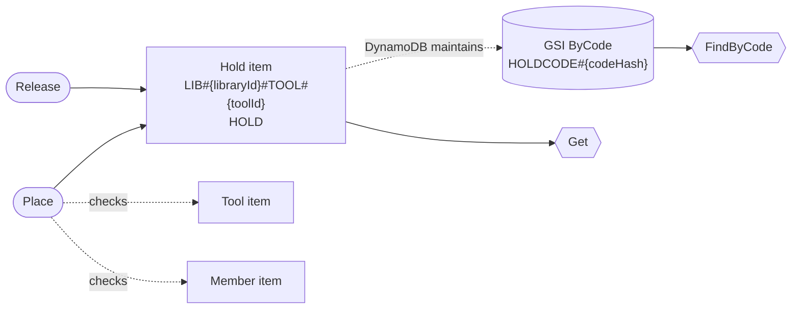

# `toollibrary` data model

> Generated by dynago from `toollibrary.dynago.yaml`. Do not edit: change the schema and run `dynago generate`.

Libraries, their members and tools, loans and pickup holds.

**Contents:** [Table](#table) · [Library](#library) · [Member](#member) · [Tool](#tool) · [Loan](#loan) · [Hold](#hold) · [Costs and risks](#costs-and-risks) · [How to read this](#how-to-read-this)

## Table

| Setting | Value |
|---|---|
| Base key | `PK` (partition, string) + `SK` (sort, string) |
| Billing | On-demand |
| TTL attribute | `ttl` (epoch seconds) |
| Entities | Library, Member, Tool, Loan, Hold |

| Global secondary index | Keys | Projection | Used by |
|---|---|---|---|
| `ByName` | `ByNamePK` + `ByNameSK` | INCLUDE `_t`, `_v`, `libraryId`, `memberId`, `name`, `role`, `status` | Member |
| `ByCategory` | `ByCategoryPK` + `ByCategorySK` | INCLUDE `_t`, `_v`, `libraryId`, `toolId`, `name`, `category`, `status`, `tags` | Tool |
| `Overdue` | `OverduePK` + `OverdueSK` | INCLUDE `_t`, `_v`, `libraryId`, `toolId`, `loanId`, `memberId`, `toolName`, `dueAt` | Loan |
| `ByCode` | `ByCodePK` | INCLUDE `_t`, `_v`, `libraryId`, `toolId`, `memberId`, `codeHash`, `expiresAt`, `ttl` | Hold |

## Library

A tool library, run by volunteers in one neighbourhood.

Schema version **1**. Go type `Library`, store `Store.Libraries`.

Writes on the left, reads on the right. Dotted arrows are maintained by DynamoDB; solid arrows are written by the generated code.

### Fields

| Field | Type | Attribute | Size p50/p99 | Notes |
|---|---|---|---|---|
| `libraryId` | string | `libraryId` | 20 / 64 B | key |
| `name` | string | `name` | 20 / 80 B |  |
| `slug` | string | `slug` | 12 / 40 B | The library's URL name. |
| `openedAt` | time | `openedAt` | 30 / 35 B |  |

### Stored items

Every item that exists because of a Library, and what keeps it up to date.

| Item | Partition key | Sort key | Example | Size p50/p99 | Maintained by |
|---|---|---|---|---|---|
| **Library** | `LIB#{libraryId}` | `LIBRARY` | `LIB#lib_1` `LIBRARY` | 162 B / 345 B | the writes below |
| Claim `Slug` | `UNIQUE#Library.Slug#{slug}` | `UNIQUE` | `UNIQUE#Library.Slug#greenwood` `UNIQUE` | ~150 B each | the writes below, in the same transaction; a conditional put makes `slug` unique. |

### Uniqueness

- **Slug**: no two Library items share `slug`. Routes /l/{slug} to its library. Global, because the URL carries nothing else.

### Access patterns

| Method | Reads | Key condition | Consistency | Requests | RRU per call p50/p99 |
|---|---|---|---|---|---|
| `Get` | item by key | `PK = LIB#{libraryId}`, `SK = LIBRARY` | eventual | GetItem | 0.5 |
| `GetBySlug` | claim `Slug`, then the item | `PK = UNIQUE#Library.Slug#{slug}` | strong | GetItem (claim) → GetItem | 2 |
| `MemberStats` | counter `MemberCounts` | `PK = LIB#{libraryId}`, `SK = COUNTS#MEMBERS` | eventual | GetItem | 0.5 |
| `ToolStats` | counter `ToolCounts` | `PK = LIB#{libraryId}`, `SK = COUNTS#TOOLS` | eventual | GetItem | 0.5 |

- `MemberStats`: The member counts, read from the library's page.

### Writes

| Method | Does | Items written | Reads first | Atomic | Version check | WRU per call p50/p99 | Fails with |
|---|---|---|---|---|---|---|---|
| `Open` | create (fails if it exists) | Library claim Slug | no | transaction (2 items) | — | 4 | `ErrLibraryExists` `ErrLibrarySlugTaken` |
| `Rename` | set `name` if given | Library | no | single item | **required** | 1 | `ErrLibraryNotFound` `dynago.ErrVersionMismatch` (with a version) `dynago.ErrVersionRequired` |
| `ChangeSlug` | set `slug` | Library claim Slug (moved: put + delete) | yes (1 consistent read; none with `dynago.From`) | transaction (3 items) | **required** | 6 | `ErrLibraryNotFound` `ErrLibrarySlugTaken` `dynago.ErrVersionMismatch` (with a version) `dynago.ErrVersionRequired` `dynago.ErrConflict` (after retries) |

- `Rename`: A steward editing the library's settings.

## Member

A person who can borrow tools from one library.

Schema version **1**. Go type `Member`, store `Store.Members`.

Writes on the left, reads on the right. Dotted arrows are maintained by DynamoDB; solid arrows are written by the generated code.

### Fields

| Field | Type | Attribute | Size p50/p99 | Notes |
|---|---|---|---|---|
| `libraryId` | string | `libraryId` | 20 / 64 B | key |
| `memberId` | string | `memberId` | 20 / 64 B | key |
| `email` | string | `email` | 25 / 80 B | Stored as given; matched case-insensitively. |
| `name` | string | `name` | 15 / 60 B |  |
| `phone` | string | `phone` | 20 / 64 B |  |
| `role` | enum: member, steward | `role` | 7 / 7 B |  |
| `status` | enum: active, suspended | `status` | 9 / 9 B |  |
| `maxLoans` | int | `maxLoans` | 8 / 11 B | How many tools the member may have out at once. |
| `joinedAt` | time | `joinedAt` | 30 / 35 B |  |

### Stored items

Every item that exists because of a Member, and what keeps it up to date.

| Item | Partition key | Sort key | Example | Size p50/p99 | Maintained by |
|---|---|---|---|---|---|
| **Member** | `LIB#{libraryId}` | `MEMBER#{memberId}` | `LIB#lib_1` `MEMBER#m_7` | 369 B / 832 B | the writes below |
| GSI `ByName` entry | `LIB#{libraryId}#MEMBERS` | `{name|lower}#{memberId}` | `LIB#lib_1#MEMBERS` `{name}#m_7` | 253 B / 607 B | DynamoDB, from the item's `ByNamePK`/`ByNameSK` attributes (eventually consistent). Sparse: absent when a key field is empty. |
| Claim `Email` | `UNIQUE#Member.Email#{libraryId}#{email|lower}` | `UNIQUE` | `UNIQUE#Member.Email#lib_1#{email}` `UNIQUE` | ~150 B each | the writes below, in the same transaction; a conditional put makes `libraryId`, `email` unique. |
| Counter `MemberCounts` | `LIB#{libraryId}` | `COUNTS#MEMBERS` | `LIB#lib_1` `COUNTS#MEMBERS` | ~100 B | the writes below, with atomic ADDs in the same transaction. |

### Indexes

- **ByName** (global secondary index, maintained by DynamoDB, eventually consistent). The member directory, alphabetical. Lower-cased in the key, so "adam" sorts before "Zoe". Projection: `role`, `status` plus key fields.

### Counters

- **MemberCounts**, keyed by `libraryId`. Holds the library's member numbers.
  - `active`: count of items where `status = "active"`.
  - `suspended`: count of items where `status = "suspended"`.
  - `stewards`: count of items where `role = "steward"` and `status = "active"`; never goes below 1. A library always keeps at least one active steward.

### Uniqueness

- **Email**: no two Member items share `libraryId`, `email`. One membership per email address in each library, ignoring case.

### Access patterns

| Method | Reads | Key condition | Consistency | Requests | RRU per call p50/p99 |
|---|---|---|---|---|---|
| `Get` | item by key | `PK = LIB#{libraryId}`, `SK = MEMBER#{memberId}` | eventual | GetItem | 0.5 |
| `GetByEmail` | claim `Email`, then the item | `PK = UNIQUE#Member.Email#{libraryId}#{email\|lower}` | strong | GetItem (claim) → GetItem | 2 |
| `Directory` | GSI `ByName`, page 50 (max 100) | `ByNamePK = LIB#{libraryId}#MEMBERS`, ascending | eventual (GSI) | Query | 2 / 4 |

### Writes

| Method | Does | Items written | Reads first | Atomic | Version check | WRU per call p50/p99 | Fails with |
|---|---|---|---|---|---|---|---|
| `Join` | create (fails if it exists) | Member GSI ByName entry counter MemberCounts claim Email | no | transaction (3 items) | — | 7 | `ErrMemberExists` `ErrMemberEmailTaken` |
| `UpdateProfile` | set `name` if given, set `phone` if given | Member GSI ByName entry (moved: delete + put) | yes (1 consistent read; none with `dynago.From`) | single item | optional | 3 | `ErrMemberNotFound` `dynago.ErrVersionMismatch` (with a version) `dynago.ErrConflict` (after retries) |
| `SetLoanCap` | set `maxLoans` | Member | no | single item | optional | 1 | `ErrMemberNotFound` `dynago.ErrVersionMismatch` (with a version) |
| `Suspend` | set `status` = "suspended" when `status = "active"` | Member GSI ByName entry counter MemberCounts | yes (1 consistent read; none with `dynago.From`) | transaction (2 items) | optional | 5 | `ErrMemberNotFound` `ErrMemberSuspendPrecondition` `ErrMemberCountsStewardsMin` `dynago.ErrVersionMismatch` (with a version) `dynago.ErrConflict` (after retries) |
| `Reinstate` | set `status` = "active" when `status = "suspended"` | Member GSI ByName entry counter MemberCounts | yes (1 consistent read; none with `dynago.From`) | transaction (2 items) | optional | 5 | `ErrMemberNotFound` `ErrMemberReinstatePrecondition` `ErrMemberCountsStewardsMin` `dynago.ErrVersionMismatch` (with a version) `dynago.ErrConflict` (after retries) |
| `MakeSteward` | set `role` = "steward" when `role = "member"` | Member GSI ByName entry counter MemberCounts | yes (1 consistent read; none with `dynago.From`) | transaction (2 items) | optional | 5 | `ErrMemberNotFound` `ErrMemberMakeStewardPrecondition` `ErrMemberCountsStewardsMin` `dynago.ErrVersionMismatch` (with a version) `dynago.ErrConflict` (after retries) |
| `StepDown` | set `role` = "member" when `role = "steward"` | Member GSI ByName entry counter MemberCounts | yes (1 consistent read; none with `dynago.From`) | transaction (2 items) | optional | 5 | `ErrMemberNotFound` `ErrMemberStepDownPrecondition` `ErrMemberCountsStewardsMin` `dynago.ErrVersionMismatch` (with a version) `dynago.ErrConflict` (after retries) |
| `Leave` | delete (fails if absent); requires counter MemberLoans to have active = 0 (a missing value counts as 0) | Member GSI ByName entry counter MemberCounts claim Email check counter MemberLoans | yes (1 consistent read; none with `dynago.From`) | transaction (4 items) | optional | 9 | `ErrMemberNotFound` `ErrMemberLeaveRequiresMemberLoans` `ErrMemberCountsStewardsMin` `dynago.ErrVersionMismatch` (with a version) `dynago.ErrConflict` (after retries) |

- `UpdateProfile`: The member editing their own profile; only what they changed is sent.
- `Leave`: Members return everything before they go.

## Tool

A tool the library lends out.

Schema version **2**. Go type `Tool`, store `Store.Tools`.

Writes on the left, reads on the right. Dotted arrows are maintained by DynamoDB; solid arrows are written by the generated code.

### Fields

| Field | Type | Attribute | Size p50/p99 | Notes |
|---|---|---|---|---|
| `libraryId` | string | `libraryId` | 20 / 64 B | key |
| `toolId` | string | `toolId` | 20 / 64 B | key |
| `name` | string | `name` | 20 / 60 B |  |
| `category` | enum: power, garden, hand, kitchen, camping | `category` | 7 / 7 B |  |
| `status` | enum: available, onLoan, retired | `status` | 9 / 9 B |  |
| `manual` | string | `manual` | 2000 / 20000 B | Care and safety notes. Large, so never listed. |
| `tags` | string_set | `tags` | 30 / 120 B |  |
| `serialNumber` | string | `serialNumber` | 20 / 64 B | The maker's serial number, if it has one. |
| `barcodes` | string_set | `barcodes` | 14 / 60 B | The library's labels on the tool, scanned at the desk. A tool can carry several (one per part of a kit). |
| `addedAt` | time | `addedAt` | 30 / 35 B |  |

### Stored items

Every item that exists because of a Tool, and what keeps it up to date.

| Item | Partition key | Sort key | Example | Size p50/p99 | Maintained by |
|---|---|---|---|---|---|
| **Tool** | `LIB#{libraryId}#TOOL#{toolId}` | `TOOL` | `LIB#lib_1#TOOL#t_42` `TOOL` | 2.4 KB / 20.5 KB | the writes below |
| GSI `ByCategory` entry | `LIB#{libraryId}#CAT#{category}` | `{name|lower}#{toolId}` | `LIB#lib_1#CAT#{category}` `{name}#t_42` | 312 B / 746 B | DynamoDB, from the item's `ByCategoryPK`/`ByCategorySK` attributes (eventually consistent). Sparse: absent when a key field is empty. |
| Claim `Serial` | `UNIQUE#Tool.Serial#{libraryId}#{serialNumber}` | `UNIQUE` | `UNIQUE#Tool.Serial#lib_1#{serialNumber}` `UNIQUE` | ~150 B each | the writes below, in the same transaction; a conditional put makes `libraryId`, `serialNumber` unique. |
| Claim `Barcode` | `UNIQUE#Tool.Barcode#{libraryId}#{barcodes}` | `UNIQUE` | `UNIQUE#Tool.Barcode#lib_1#{barcodes}` `UNIQUE` | ~150 B each | the writes below, in the same transaction; one claim per element of `barcodes`, each taken by a conditional put. |
| Counter `ToolCounts` | `LIB#{libraryId}` | `COUNTS#TOOLS` | `LIB#lib_1` `COUNTS#TOOLS` | ~100 B | the writes below, with atomic ADDs in the same transaction. |

### Indexes

- **ByCategory** (global secondary index, maintained by DynamoDB, eventually consistent). The catalogue, by category then name. Status is projected, so lending doesn't move entries. Projection: `status`, `tags` plus key fields.

### Counters

- **ToolCounts**, keyed by `libraryId`. Holds the library's catalogue numbers.
  - `available`: count of items where `status = "available"`.
  - `onLoan`: count of items where `status = "onLoan"`.
  - `retired`: count of items where `status = "retired"`.

### Uniqueness

- **Serial**: no two Tool items share `libraryId`, `serialNumber`. Stops the same physical tool being catalogued twice. Tools without a serial number make no claim.
- **Barcode**: for the same `libraryId`, no element of `barcodes` appears in two Tool items. Each label identifies one tool: one claim per barcode, so the desk can look a tool up by any of them.

### Access patterns

| Method | Reads | Key condition | Consistency | Requests | RRU per call p50/p99 |
|---|---|---|---|---|---|
| `Get` | item by key | `PK = LIB#{libraryId}#TOOL#{toolId}`, `SK = TOOL` | eventual | GetItem | 0.5 / 3 |
| `Catalogue` | GSI `ByCategory`, page 25 (max 100) | `ByCategoryPK = LIB#{libraryId}#CAT#{category}`, ascending | eventual (GSI) | Query | 1 / 2.5 |
| `GetByBarcode` | claim `Barcode`, then the item | `PK = UNIQUE#Tool.Barcode#{libraryId}#{barcodes}` | strong | GetItem (claim) → GetItem | 2 / 7 |

### Writes

| Method | Does | Items written | Reads first | Atomic | Version check | WRU per call p50/p99 | Fails with |
|---|---|---|---|---|---|---|---|
| `Add` | create (fails if it exists) | Tool GSI ByCategory entry counter ToolCounts claim Serial claims Barcode (one per barcodes element) | no | transaction (6 items) | — | 13 / 53 | `ErrToolExists` `ErrToolSerialTaken` `ErrToolBarcodeTaken` |
| `EditDetails` | set `name` if given, set `manual` if given, set `tags` if given | Tool GSI ByCategory entry (moved: delete + put) | yes (1 consistent read; none with `dynago.From`) | single item | **required** | 5 / 23 | `ErrToolNotFound` `dynago.ErrVersionMismatch` (with a version) `dynago.ErrVersionRequired` `dynago.ErrConflict` (after retries) |
| `Relabel` | set `barcodes` | Tool claims Barcode (added and dropped barcodes elements) | yes (1 consistent read; none with `dynago.From`) | transaction (7 items) | optional | 10 / 54 | `ErrToolNotFound` `ErrToolBarcodeTaken` `dynago.ErrVersionMismatch` (with a version) `dynago.ErrConflict` (after retries) |
| `Retire` | set `status` = "retired" when `status = "available"`; requires nothing of any Hold and deletes the Hold if there is one | Tool GSI ByCategory entry counter ToolCounts Hold (deletes the Hold if there is one) Hold's GSI ByCode entry | no: read-free (reads only if the item is not in the assumed state) | transaction (3 items) | optional | 12 / 48 | `ErrToolNotFound` `ErrToolRetirePrecondition` `dynago.ErrVersionMismatch` (with a version) `dynago.ErrConflict` (after retries) |

- `Relabel`: Replaces the tool's labels: new ones are claimed, dropped ones freed.
- `Retire`: Takes the tool out of the catalogue, cancelling any hold on it.

## Loan

A member borrowing a tool.

Schema version **1**. Go type `Loan`, store `Store.Loans`.

Writes on the left, reads on the right. Dotted arrows are maintained by DynamoDB; solid arrows are written by the generated code.

### Fields

| Field | Type | Attribute | Size p50/p99 | Notes |
|---|---|---|---|---|
| `libraryId` | string | `libraryId` | 20 / 64 B | key |
| `toolId` | string | `toolId` | 20 / 64 B | key |
| `loanId` | string | `loanId` | 20 / 64 B | key; A ULID, so a tool's loans sort by time. |
| `memberId` | string | `memberId` | 20 / 64 B |  |
| `toolName` | string | `toolName` | 20 / 60 B | **copy of Tool.name, not kept in sync by dynago**; Shown in "my loans" without reading the tool. |
| `status` | enum: active, returned | `status` | 8 / 8 B | Set by Borrow and Return; callers never choose it. |
| `borrowedAt` | time | `borrowedAt` | 30 / 35 B |  |
| `dueAt` | time | `dueAt` | 30 / 35 B |  |
| `returnedAt` | time | `returnedAt` | 30 / 35 B |  |
| `notes` | string | `notes` | 0 / 1000 B | Condition notes from the steward. Not listed. |

### Stored items

Every item that exists because of a Loan, and what keeps it up to date.

| Item | Partition key | Sort key | Example | Size p50/p99 | Maintained by |
|---|---|---|---|---|---|
| **Loan** | `LIB#{libraryId}#TOOL#{toolId}` | `LOAN#{loanId}` | `LIB#lib_1#TOOL#t_42` `LOAN#ln_9` | 464 B / 1.9 KB | the writes below |
| Copy `ByMember` | `LIB#{libraryId}#MEMBER#{memberId}` | `MYLOAN#{dueAt}#{toolId}#{loanId}` | `LIB#lib_1#MEMBER#m_7` `MYLOAN#2026-10-12T17:00:00.000000000Z#t_42#ln_9` | 317 B / 714 B | the writes below, in the same transaction as the item. Only when `status = "active"`. |
| GSI `Overdue` entry | `LIB#{libraryId}#DUE` | `{dueAt}#{loanId}` | `LIB#lib_1#DUE` `2026-10-12T17:00:00.000000000Z#ln_9` | 358 B / 799 B | DynamoDB, from the item's `OverduePK`/`OverdueSK` attributes (eventually consistent). Sparse: absent when a key field is empty. Only when `status = "active"`. |
| Counter `MemberLoans` | `LIB#{libraryId}#MEMBER#{memberId}` | `LOANS` | `LIB#lib_1#MEMBER#m_7` `LOANS` | ~100 B | the writes below, with atomic ADDs in the same transaction. |
| Counter `LoanTotals` | `LIB#{libraryId}#LOANTOTALS#S{0..3}` | `TOTALS` | `LIB#lib_1#LOANTOTALS` `TOTALS` | ~100 B | the writes below, with atomic ADDs in the same transaction. |

### Indexes

- **ByMember** (copy items written in the same transaction as the entity, readable strongly consistently). A member's current loans, soonest due first. Copies, not a GSI, so a member sees a loan the moment they take it; returned loans drop out. Projection: `toolName`, `dueAt` plus key fields.
- **Overdue** (global secondary index, maintained by DynamoDB, eventually consistent). Active loans by due date, for the steward's reminder run. Returned loans drop out. Projection: `memberId`, `toolName` plus key fields.

### Counters

- **MemberLoans**, keyed by `libraryId`, `memberId`. Counts each member's loans.
  - `active`: count of items where `status = "active"`; writes that grow it take a caller-supplied limit. Capped by the member's maxLoans.
- **LoanTotals**, keyed by `libraryId`. Counts every loan the library has made. Sharded to show how: a counter that every write of a busy entity touches can take ~1,000 writes/s per shard. This library's rate needs one item. Spread over 4 shards; reads sum them with one BatchGetItem.
  - `started`: count of items.

### Access patterns

| Method | Reads | Key condition | Consistency | Requests | RRU per call p50/p99 |
|---|---|---|---|---|---|
| `Get` | item by key | `PK = LIB#{libraryId}#TOOL#{toolId}`, `SK = LOAN#{loanId}` | eventual | GetItem | 0.5 |
| `History` | entity partition, only `libraryId`, `toolId`, `loanId`, `memberId`, `status`, `borrowedAt`, `dueAt`, `returnedAt`, page 20 (max 100) | `PK = LIB#{libraryId}#TOOL#{toolId}`, `begins_with(SK, "LOAN#")`, descending | eventual | Query | 1.5 / 5 |
| `MyLoans` | copies `ByMember`, page 50 (max 100) | `PK = LIB#{libraryId}#MEMBER#{memberId}`, `begins_with(SK, "MYLOAN#")`, ascending | strong | Query | 4 / 9 |
| `Overdue` | GSI `Overdue`, page 50 (max 100) | `OverduePK = LIB#{libraryId}#DUE`, `OverdueSK` between optional bounds on `dueAt`, ascending | eventual (GSI) | Query | 2.5 / 5 |
| `ActiveLoans` | counter `MemberLoans` | `PK = LIB#{libraryId}#MEMBER#{memberId}`, `SK = LOANS` | eventual | GetItem | 0.5 |
| `Totals` | counter `LoanTotals` | `PK = LIB#{libraryId}#LOANTOTALS`, `SK = TOTALS` | eventual | BatchGetItem (4 shards) | 2 |

- `History`: A tool's loans, newest first, without the notes.
- `MyLoans`: A member's current loans, soonest due first.

### Writes

| Method | Does | Items written | Reads first | Atomic | Version check | WRU per call p50/p99 | Fails with |
|---|---|---|---|---|---|---|---|
| `Borrow` | create (fails if it exists), set `status` = "active"; requires the Member to exist with status = "active"; requires the Tool to exist with status = "available" and sets its status to "onLoan"; requires any Hold to have memberId = Loan.memberId (an absent or expired one passes) and deletes the Hold if there is one | Loan copy ByMember GSI Overdue entry counter MemberLoans counter LoanTotals check Member Tool (sets its status to "onLoan") Tool's GSI ByCategory entry Tool's counter ToolCounts Hold (deletes the Hold if there is one) Hold's GSI ByCode entry | no | transaction (8 items) | — | 23 / 61 | `ErrLoanExists` `ErrLoanBorrowRequiresMember` `ErrLoanBorrowRequiresTool` `ErrLoanBorrowRequiresHold` `dynago.ErrFieldRequired` (a required field is empty) `dynago.ErrLimitRequired` (no limit given) `ErrMemberLoansActiveLimit` |
| `Return` | set `returnedAt`, set `status` = "returned" when `status = "active"`; requires the Tool to exist with status = "onLoan" and sets its status to "available" | Loan copy ByMember (moved: put + delete) GSI Overdue entry (moved: delete + put) counter MemberLoans Tool (sets its status to "available") Tool's GSI ByCategory entry Tool's counter ToolCounts | yes (1 consistent read; none with `dynago.From`) | transaction (6 items) | optional | 19 / 57 | `ErrLoanNotFound` `ErrLoanReturnPrecondition` `ErrLoanReturnRequiresTool` `dynago.ErrVersionMismatch` (with a version) `dynago.ErrConflict` (after retries) |
| `Extend` | set `dueAt` when `status = "active"` | Loan copy ByMember (moved: put + delete) GSI Overdue entry (moved: delete + put) | yes (1 consistent read; none with `dynago.From`) | transaction (3 items) | optional | 8 / 10 | `ErrLoanNotFound` `ErrLoanExtendPrecondition` `dynago.ErrFieldRequired` (a required field is empty) `dynago.ErrVersionMismatch` (with a version) `dynago.ErrConflict` (after retries) |
| `AddNote` | set `notes` if given | Loan | no | single item | optional | 1 / 2 | `ErrLoanNotFound` `dynago.ErrVersionMismatch` (with a version) |

## Hold

A tool reserved for a member to collect, with a pickup code. While it is live, only that member can borrow the tool; borrowing collects it. Lapses after two days.

Schema version **1**. Go type `Hold`, store `Store.Holds`.

Writes on the left, reads on the right. Dotted arrows are maintained by DynamoDB; solid arrows are written by the generated code.

### Fields

| Field | Type | Attribute | Size p50/p99 | Notes |
|---|---|---|---|---|
| `libraryId` | string | `libraryId` | 20 / 64 B | key |
| `toolId` | string | `toolId` | 20 / 64 B | key |
| `memberId` | string | `memberId` | 20 / 64 B |  |
| `codeHash` | string | `codeHash` | 64 / 64 B | HMAC-SHA256 of the pickup code under a server-side secret, hex-encoded. Neither the code nor a plain hash of it is stored: keys end up in backups and logs, and a short code's plain hash is reversed by trying every code. |
| `createdAt` | time | `createdAt` | 30 / 35 B |  |
| `expiresAt` | time | `expiresAt` | 30 / 35 B | TTL: the item expires at this time; When the hold lapses. Required: a hold without one would reserve the tool forever. |

### Stored items

Every item that exists because of a Hold, and what keeps it up to date.

| Item | Partition key | Sort key | Example | Size p50/p99 | Maintained by |
|---|---|---|---|---|---|
| **Hold** | `LIB#{libraryId}#TOOL#{toolId}` | `HOLD` | `LIB#lib_1#TOOL#t_42` `HOLD` | 398 B / 630 B | the writes below |
| GSI `ByCode` entry | `HOLDCODE#{codeHash}` | — | `HOLDCODE#{codeHash}` | 343 B / 568 B | DynamoDB, from the item's `ByCodePK`/`ByCodeSK` attributes (eventually consistent). Sparse: absent when a key field is empty. |

### Indexes

- **ByCode** (global secondary index, maintained by DynamoDB, eventually consistent). Finds a hold from its code. A GSI, not a claim: the hold expires by TTL and its index entry goes with it, whereas a claim would be left behind. Projection: `memberId`, `expiresAt` plus key fields.

### Access patterns

| Method | Reads | Key condition | Consistency | Requests | RRU per call p50/p99 |
|---|---|---|---|---|---|
| `Get` | item by key | `PK = LIB#{libraryId}#TOOL#{toolId}`, `SK = HOLD` | eventual | GetItem | 0.5 |
| `FindByCode` | GSI `ByCode`, page 1 (max 1) | `ByCodePK = HOLDCODE#{codeHash}`, ascending | eventual (GSI) | Query | 0.5 |

### Writes

| Method | Does | Items written | Reads first | Atomic | Version check | WRU per call p50/p99 | Fails with |
|---|---|---|---|---|---|---|---|
| `Place` | create (fails if it exists); requires the Tool to exist with status = "available"; requires the Member to exist with status = "active" | Hold GSI ByCode entry check Tool check Member | no | transaction (3 items) | — | 11 / 47 | `ErrHoldExists` `ErrHoldPlaceRequiresTool` `ErrHoldPlaceRequiresMember` `dynago.ErrFieldRequired` (a required field is empty) |
| `Release` | delete (fails if absent) | Hold GSI ByCode entry | no | single item | optional | 2 | `ErrHoldNotFound` `dynago.ErrVersionMismatch` (with a version) |

## Costs and risks

| | Subject | Finding |
|---|---|---|
| ⚠️ warning | Tool | manual (p99 19.5 KB) makes every write cost up to 21 WRU, including writes that never change it: Relabel, Retire, Loan.Borrow, Loan.Return. Consider moving it to an entity of its own, written only when it changes. |
| ⚠️ warning | Loan.toolName | copies Tool.name. dynago keeps copies within one entity in sync, but not this one: when Tool.name changes, your code must rewrite every Loan that copied it. |

| Entity | Items (assumed) | Item p50/p99 | Storage incl. indexes | Storage $/month | Throughput $/month at declared rates |
|---|---|---|---|---|---|
| Library | 2000 | 162 B / 345 B | 0.00 GB | $0.00 | $0.00 |
| Member | 40000 | 369 B / 832 B | 0.04 GB | $0.01 | $0.00 |
| Tool | 120000 | 2.4 KB / 20.5 KB | 0.38 GB | $0.10 | $0.00 |
| Loan | 2000000 | 464 B / 1.9 KB | 2.68 GB | $0.67 | $74.52 |
| Hold | 3000 | 398 B / 630 B | 0.00 GB | $0.00 | $0.00 |

Estimated total: **$75.30/month** for the declared item counts and rates.

Assumptions:

- Sizes use each field's declared size (p50/p99); undeclared sizes use type defaults (string 20/64 B, time 30/35 B, int 8/11 B).
- Every declared field is assumed present; empty fields are not stored, so real items are usually smaller.
- A unique string set makes one claim per element; the number of elements is estimated from the set's declared size at 20 B per element.
- Capacity follows DynamoDB rules: 1 WRU per started 1 KB written, 1 RRU per started 4 KB read strongly (half for eventually consistent); transactions cost double, and a condition check on another item is billed as a transactional write of that item.
- GSI and copy writes are counted as one index write per entry; an index key change is a delete plus a put.
- Prices: $0.625 per million WRU, $0.125 per million RRU, $0.25 per GB-month (on-demand).
- Monthly figures use each access pattern's and write's declared average rate (rate:, per second); patterns without a rate are not costed.

## How to read this

- **Everything lives in one table.** Items are addressed by a partition key (`PK`) and a sort key (`SK`). Items sharing a partition key are stored together and can be read with one Query, in sort key order.
- **Key patterns** such as `LIB#{libraryId}#TOOL#{toolId}` show how keys are built: literal text plus field values. Times in keys are fixed-width UTC so they sort chronologically.
- **Entities** are the domain types. Each is stored as one item, plus the items listed under *Stored items*: index entries, copies, uniqueness claims and counters. The generated code writes and deletes those together.
- **Global secondary indexes (GSIs)** re-key the same items so they can be queried another way. DynamoDB keeps them up to date asynchronously, so reads through them are eventually consistent (usually well under a second behind). An entity only appears in an index while every field its index keys use is set, so an index can hold a subset (a *sparse* index).
- **Copies** are an alternative to a GSI: separate items written in the same transaction as the entity. They cost a transaction on every write but can be read back immediately.
- **Claims** make a value unique: creating the entity also creates an item keyed by the value, conditional on it not existing.
- **Counters** are items updated with atomic ADD in the same transaction as the entity, so counts never drift from the items they count. A limit on a counter value turns into a condition, which is how capacity is enforced without races.
- **Access patterns** are the only reads the code can do: each is one request (or two for a lookup by a unique value). A query nobody declared does not exist as a method, so every new way of reading data shows up in review as a schema change.
- **Costs** are in DynamoDB capacity units: a write costs 1 WRU per KB, a read 1 RRU per 4 KB (half for eventually consistent reads), and transactions cost double.
- **Document versions** guard against lost updates. Every entity the store returns knows the version it was read at (`Version()`, an opaque string suitable for an ETag). Passing it back with a write (`dynago.IfVersion`, or the entity itself with `dynago.From`) makes the write fail if anyone changed the item since, rather than silently overwriting their change. Writes marked *required* refuse to run without one.
- **Schema versions** are stored on every item (`_v`), along with the entity type (`_t`) and a revision counter (`_rev`) that guards read-modify-write updates.

