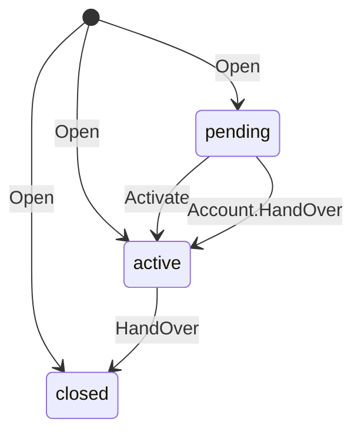
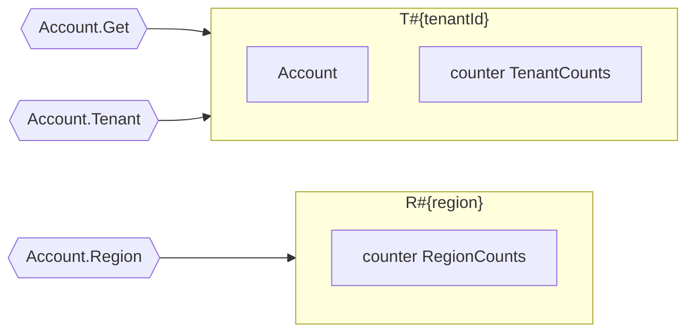
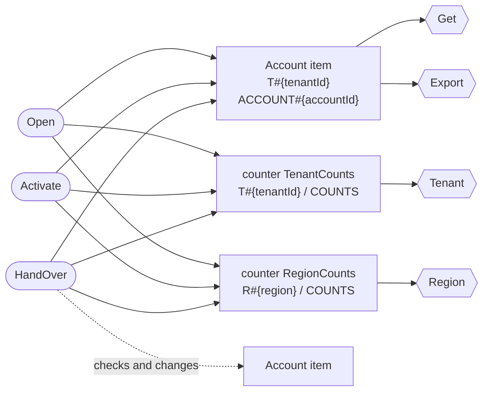

# `fixture` data model

> Generated by dynago from `fixture.dynago.yaml`. Do not edit: change the schema and run `dynago generate`.

Table generation **1**: `fixture-g1`.

**Contents:** [Summary](#summary) · [Domain](#domain) · [Reads](#reads) · [Writes](#writes) · [Storage and partitions](#storage-and-partitions) · [Risks and costs](#risks-and-costs) · [Reference](#reference) · [How to read this](#how-to-read-this)

## Summary

| | |
|---|---|
| Entities | 1: Account |
| Reads | 4: 1 by key, 2 counters, 1 scan |
| Writes | 3: 3 in a transaction, 2 reading the item first |
| Indexes | 0 GSIs, 0 copy indexes |
| Uniqueness claims, counters | 0, 2 |
| Workload | No peak factor declared (peaks taken as the averages); volumes declared for 0 of 1 entities |
| Cost | $0.00/month at the declared volumes and rates |
| Findings | 0 errors, 0 warnings, 1 note open; 0 accepted |

## Domain

### Entities

| Entity | What it is | Identified by | Volume | Expected items |
|---|---|---|---|---|
| [Account](#account) |  | `tenantId`, `accountId` | not declared | — |

### Guarantees

What the generated code enforces on every write, so no bug or race elsewhere can break it.

- **Account**
  - HandOver requires the Account to exist with status = "pending", and sets its status to "active", in one transaction. *(Account.HandOver)*

### Lifecycles

How writes move each status-like field between its values. `*` marks a write that doesn't check the current value, or lets the caller choose the new one.

#### Account.status

Open lets the caller choose the first value; no write moves a Account out of `closed`.

## Reads

Every read the code can make. A read that isn't listed has no method, so a new way of reading the data can only arrive as a change to the schema, and to this document.

| Read | Answers | Served by | Freshness | Returns | RRU per call p50/p99 | Rate |
|---|---|---|---|---|---|---|
| `Account.Get` | One Account, by tenantId and accountId. | GetItem | eventual (not stated) | one | 0.5 | — |
| `Account.Tenant` | The TenantCounts counts for a tenantId. | counter TenantCounts (GetItem) | eventual (not stated) | the counts | 0.5 | — |
| `Account.Region` | The RegionCounts counts for a region. | counter RegionCounts (GetItem) | eventual (not stated) | the counts | 0.5 | — |
| `Account.Export` | Every Account in the table. | Scan of the whole table, one page per call | eventual (not stated) | pages of 2, a page at a time (volume not declared) | 0.5 | — |

- **`Account.Export` scans the whole table.** Reason: the audit export reads every account

## Writes

Every write the code can make, and everything each changes. Each is atomic: all of it happens, or none of it does.

| Write | Does | Checks | Changes | Reads first | Atomic | WRU per call p50/p99 | Rate |
|---|---|---|---|---|---|---|---|
| `Account.Open` | Creates a Account | no Account at the key | Account counter TenantCounts counter RegionCounts | no | transaction, 3 items | 6 | — |
| `Account.Activate` | Sets `status` = "active" | the Account exists; status = "pending" | Account counter TenantCounts counter RegionCounts | yes | transaction, 3 items | 6 | — |
| `Account.HandOver` | Sets `successorId`, sets `status` = "closed", sets the Account's status to "active" | the Account exists; status = "active"; the Account exists with status = "pending" | Account counter TenantCounts counter RegionCounts Account (sets its status to "active") Account's counter TenantCounts Account's counter RegionCounts | yes | transaction, 6 items | 12 | — |

## Storage and partitions

### Table

| Setting | Value |
|---|---|
| Table | `fixture-g1` (generation 1) |
| Base key | `PK` (partition, string) + `SK` (sort, string) |
| Billing | On-demand |

The table has no indexes.

### Partition map

Which items share a partition, in the base table and in each GSI, and which reads reach them.

`Account.Export` scans every partition of the base table.

### Partitions

Each row is every partition key value one key pattern renders: *Keys* is how many values there are. Counts are per value: typical, then the largest. Traffic is the busiest value's at peak.

| Partition key | In | Keys | Holds | Size, typical / largest | Grows | Busiest key at peak | Risk |
|---|---|---|---|---|---|---|---|
| `T#{tenantId}` | base table | unknown | Account: unknown counter TenantCounts: 1 | unknown / unknown | yes: Account never removed | no rates declared | — |
| `R#{region}` | base table | unknown | counter RegionCounts: 1 | 136 B / 136 B | no | no rates declared | — |

Unknown counts: nothing declares how many items share a value of `tenantId` in `T#{tenantId}`, `region` in `R#{region}`. For a field that identifies another entity, name it (`ref:`, or a matching field name) and give the spread (`volume.by`).

## Risks and costs

| | Rule | About | Finding |
|---|---|---|---|
| ℹ️ note | `scan` | access Account.Export | scans the whole table, every entity's items, for its Accounts, one page per call: the audit export reads every account. |

### Costs

| Entity | Expected items | Item p50/p99 | Storage incl. indexes | Storage $/month | Throughput $/month at declared rates |
|---|---|---|---|---|---|
| Account | not declared | 277 B / 543 B | 0.00 GB | $0.00 | $0.00 |

Estimated total: **$0.00/month** for the declared volumes and rates.

Assumptions:

- Volumes describe the table at no stated point in time (no workload.horizon).
- Peak traffic is assumed equal to the declared average rates (no workload.peak).
- Items per partition follow the volumes: an entity's items per parent (typical and max), multiplied up the parents. A partition's largest count takes the biggest skew along its path, not every one at once.
- An enum in a partition key splits the items evenly among its values typically; at worst they all share one. A field that refers to another entity (by name, ref or requires) spreads the items evenly over that entity's items, unless volume.by says otherwise. Any other field leaves the count unknown.
- Index entries are counted as if every item had one: `where` and empty key fields only make an index smaller.
- The busiest partition gets traffic in proportion to its share of the items: its largest count over the entity's total. A write's declared hot_key_rate replaces that estimate for every partition it touches.
- A partition key value takes at most 1000 WRU and 3000 RRU per second. Risk is the larger share of either at peak: low under 10%, medium under 50%, high above.
- Sizes use each field's declared size (p50/p99); undeclared sizes use type defaults (string 20/64 B, time 30/35 B, int 8/11 B).
- Every declared field is assumed present; empty fields are not stored, so real items are usually smaller.
- A unique string set makes one claim per element; the number of elements is estimated from the set's declared size at 20 B per element.
- Capacity follows DynamoDB rules: 1 WRU per started 1 KB written, 1 RRU per started 4 KB read strongly (half for eventually consistent); transactions cost double, and a condition check on another item is billed as a transactional write of that item.
- GSI and copy writes are counted as one index write per entry; an index key change is a delete plus a put.
- Prices: $0.625 per million WRU, $0.125 per million RRU, $0.25 per GB-month (on-demand).
- Monthly figures use each access pattern's and write's declared average rate (rate:, per second); patterns without a rate are not costed.
- Storage counts each entity's items, index entries and claims at its declared volume, plus 100 bytes of overhead per item. A scan reads the base table's items, copies and claims, without GSI entries or overhead; counter items aren't counted.

## Reference

Each entity in full: its fields, every item stored for it, the key condition of each read, and the errors each write returns.

### Account

Schema version **1**. Go type `Account`, store `Store.Accounts`.

Writes on the left, reads on the right. Dotted arrows are maintained by DynamoDB; solid arrows are written by the generated code.

#### Fields

| Field | Type | Attribute | Size p50/p99 | Notes |
|---|---|---|---|---|
| `tenantId` | string | `tenantId` | 20 / 64 B | key |
| `accountId` | string | `accountId` | 20 / 64 B | key |
| `region` | string | `region` | 20 / 64 B |  |
| `status` | enum: pending, active, closed | `status` | 7 / 7 B |  |
| `successorId` | string | `successorId` | 20 / 64 B |  |

#### Stored items

Every item that exists because of an Account, and what keeps it up to date.

| Item | Partition key | Sort key | Example | Size p50/p99 | Maintained by |
|---|---|---|---|---|---|
| **Account** | `T#{tenantId}` | `ACCOUNT#{accountId}` | `T#{tenantId}` `ACCOUNT#{accountId}` | 277 B / 543 B | the writes below |
| Counter `TenantCounts` | `T#{tenantId}` | `COUNTS` | `T#{tenantId}` `COUNTS` | ~150 B | the writes below, with atomic ADDs in the same transaction. |
| Counter `RegionCounts` | `R#{region}` | `COUNTS` | `R#{region}` `COUNTS` | ~136 B | the writes below, with atomic ADDs in the same transaction. |

#### Counters

- **TenantCounts**, keyed by `tenantId`. 
  - `active`: count of items where `status = "active"`.
  - `closed`: count of items where `status = "closed"`.
- **RegionCounts**, keyed by `region`. 
  - `active`: count of items where `status = "active"`.

#### Access patterns

| Method | Reads | Key condition | Consistency | Requests | RRU per call p50/p99 |
|---|---|---|---|---|---|
| `Get` | item by key | `PK = T#{tenantId}`, `SK = ACCOUNT#{accountId}` | eventual | GetItem | 0.5 |
| `Tenant` | counter `TenantCounts` | `PK = T#{tenantId}`, `SK = COUNTS` | eventual | GetItem | 0.5 |
| `Region` | counter `RegionCounts` | `PK = R#{region}`, `SK = COUNTS` | eventual | GetItem | 0.5 |
| `Export` | the whole table, page 2 (max 100) | none: a Scan, filtered to `_t = Account` | eventual | Scan (one page) | 0.5 |

#### Writes

| Method | Does | Items written | Reads first | Atomic | Version check | WRU per call p50/p99 | Fails with |
|---|---|---|---|---|---|---|---|
| `Open` | create (fails if it exists) | Account counter TenantCounts counter RegionCounts | no | transaction (3 items) | — | 6 | `ErrAccountExists` |
| `Activate` | set `status` = "active" when `status = "pending"` | Account counter TenantCounts counter RegionCounts | yes (1 consistent read; none with `dynago.From`) | transaction (3 items) | optional | 6 | `ErrAccountNotFound` `ErrAccountActivatePrecondition` `dynago.ErrVersionMismatch` (with a version) `dynago.ErrConflict` (after retries) |
| `HandOver` | set `successorId`, set `status` = "closed" when `status = "active"`; requires the Account to exist with status = "pending" and sets its status to "active" | Account counter TenantCounts counter RegionCounts Account (sets its status to "active") Account's counter TenantCounts Account's counter RegionCounts | yes (1 consistent read; none with `dynago.From`) | transaction (6 items) | optional | 12 | `ErrAccountNotFound` `ErrAccountHandOverPrecondition` `ErrAccountHandOverRequiresAccount` `dynago.ErrVersionMismatch` (with a version) `dynago.ErrConflict` (after retries) |

## How to read this

- **Items and keys.** Everything lives in one table. Items are addressed by a partition key (`PK`) and a sort key (`SK`). Items sharing a partition key are stored together and can be read with one Query, in sort key order. Key patterns such as `LIB#{libraryId}#TOOL#{toolId}` show how keys are built: literal text plus field values. Times in keys are fixed-width UTC so they sort chronologically.
- **Entities** are the domain types. Each is stored as one item, plus the items listed under *Stored items* in the reference: index entries, copies, uniqueness claims and counters. The generated code writes and deletes the copies, claims and counters in the same transaction as the item; DynamoDB maintains the GSI entries itself.
- **Reads and writes** are the only ones the code can do: each read is one request (two for a lookup by a unique value), and each write is atomic. A read or write nobody declared has no method, so every new one shows up in review as a change to this document.
- **Global secondary indexes (GSIs)** re-key the same items so they can be queried another way. DynamoDB keeps them up to date asynchronously, so reads through them are eventually consistent (usually well under a second behind). An entity only appears in an index while every text or time field its index keys use is set, and its `where` holds, so an index can hold a subset (a *sparse* index).
- **Copies** are the other way to index: separate items written in the same transaction as the entity. Writes that change them become transactions, but reads see a write immediately. dynago picks a copy when a read declares `freshness: immediate`.
- **Claims** make a value unique: creating the entity also creates an item keyed by the value, conditional on it not existing.
- **Counters** are items updated with atomic ADD in the same transaction as the entity, so counts never drift from the items they count. A limit on a counter value turns into a condition, which is how capacity is enforced without races.
- **Partitions.** A partition key value's items (an *item collection*) are served by one DynamoDB partition, which takes at most 1,000 write units and 3,000 read units a second. The partition table estimates, from the declared volumes and rates, how many items each partition key value holds, how big it gets, and how close its busiest value comes to those limits at peak.
- **Costs** are in DynamoDB capacity units: a write costs 1 WRU per started KB, a read 1 RRU per started 4 KB (half for eventually consistent reads), and transactions cost double.
- **Findings** have a rule id. A schema can accept a warning or note with a reason (`accept: { rule: reason }` on the thing it's about); errors must be fixed. A `dynago.policy.yaml` can change a rule's severity and which severities fail the build.
- **Document versions** guard against lost updates. Every entity the store returns knows the version it was read at (`Version()`, an opaque string suitable for an ETag). Passing it back with a write (`dynago.IfVersion`, or the entity itself with `dynago.From`) makes the write fail if anyone changed the item since, rather than silently overwriting their change. Writes marked *required* refuse to run without one.
- **Schema versions** are stored on every item (`_v`), along with the entity type (`_t`), a revision counter (`_rev`) that guards read-modify-write updates, and when the item was first written and last changed (`_created`, `_updated`, by the writing server's clock).
- **Table generations.** A schema change that existing items don't fit (adding, changing or dropping an index, claim or counter; a changed key; a changed field type; a field made required) moves the data to a new table, `<name>-g<generation>`, copied by a generated migration job; the old table stays for rollback.

