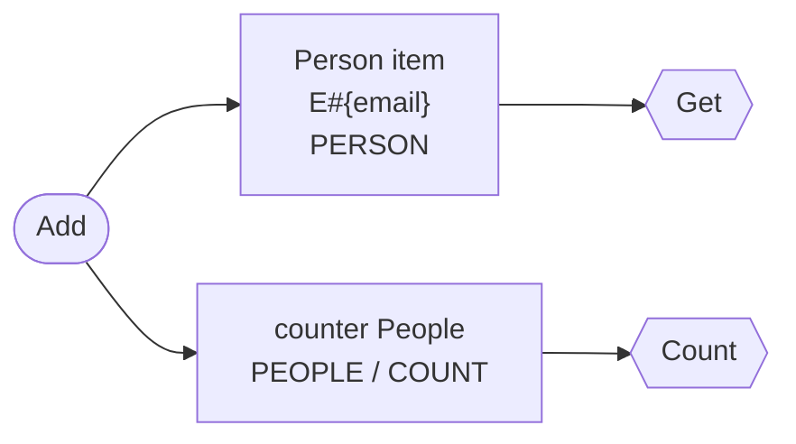

# `rekey` data model

> Generated by dynago from `rekey.dynago.yaml`. Do not edit: change the schema and run `dynago generate`.

Table generation **2**: `rekey-g2`. It is filled from generation 1 (`rekey-g1`) by the migration job (`RunMigration`); `rekey-g1` stays for rollback. See the [migrations guide](https://github.com/nicklanng/dynago/blob/main/docs/guides/migrations.md).

**Contents:** [Table](#table) · [Person](#person) · [Costs and risks](#costs-and-risks) · [How to read this](#how-to-read-this)

## Table

| Setting | Value |
|---|---|
| Base key | `PK` (partition, string) + `SK` (sort, string) |
| Billing | On-demand |
| Entities | Person |

The table has no global secondary indexes.

## Person

Schema version **2**. Go type `Person`, store `Store.Persons`.

Writes on the left, reads on the right. Dotted arrows are maintained by DynamoDB; solid arrows are written by the generated code.

### Fields

| Field | Type | Attribute | Size p50/p99 | Notes |
|---|---|---|---|---|
| `personId` | string | `personId` | 20 / 64 B |  |
| `email` | string | `email` | 20 / 64 B | key |
| `name` | string | `name` | 20 / 64 B |  |

### Stored items

Every item that exists because of a Person, and what keeps it up to date.

| Item | Partition key | Sort key | Example | Size p50/p99 | Maintained by |
|---|---|---|---|---|---|
| **Person** | `E#{email}` | `PERSON` | `E#{email}` `PERSON` | 128 B / 306 B | the writes below |
| Counter `People` | `PEOPLE` | `COUNT` | `PEOPLE` `COUNT` | ~100 B | the writes below, with atomic ADDs in the same transaction. |

### Counters

- **People**, keyed by . 
  - `all`: count of items.

### Access patterns

| Method | Reads | Key condition | Consistency | Requests | RRU per call p50/p99 |
|---|---|---|---|---|---|
| `Get` | item by key | `PK = E#{email}`, `SK = PERSON` | eventual | GetItem | 0.5 |
| `Count` | counter `People` | `PK = PEOPLE`, `SK = COUNT` | eventual | GetItem | 0.5 |

### Writes

| Method | Does | Items written | Reads first | Atomic | Version check | WRU per call p50/p99 | Fails with |
|---|---|---|---|---|---|---|---|
| `Add` | create (fails if it exists) | Person counter People | no | transaction (2 items) | — | 4 | `ErrPersonExists` |

## Costs and risks

No findings.

| Entity | Items (assumed) | Item p50/p99 | Storage incl. indexes | Storage $/month | Throughput $/month at declared rates |
|---|---|---|---|---|---|
| Person | not declared | 128 B / 306 B | 0.00 GB | $0.00 | $0.00 |

Estimated total: **$0.00/month** for the declared item counts and rates.

Assumptions:

- Sizes use each field's declared size (p50/p99); undeclared sizes use type defaults (string 20/64 B, time 30/35 B, int 8/11 B).
- Every declared field is assumed present; empty fields are not stored, so real items are usually smaller.
- A unique string set makes one claim per element; the number of elements is estimated from the set's declared size at 20 B per element.
- Capacity follows DynamoDB rules: 1 WRU per started 1 KB written, 1 RRU per started 4 KB read strongly (half for eventually consistent); transactions cost double, and a condition check on another item is billed as a transactional write of that item.
- GSI and copy writes are counted as one index write per entry; an index key change is a delete plus a put.
- Prices: $0.625 per million WRU, $0.125 per million RRU, $0.25 per GB-month (on-demand).
- Monthly figures use each access pattern's and write's declared average rate (rate:, per second); patterns without a rate are not costed.

## How to read this

- **Everything lives in one table.** Items are addressed by a partition key (`PK`) and a sort key (`SK`). Items sharing a partition key are stored together and can be read with one Query, in sort key order.
- **Key patterns** such as `LIB#{libraryId}#TOOL#{toolId}` show how keys are built: literal text plus field values. Times in keys are fixed-width UTC so they sort chronologically.
- **Entities** are the domain types. Each is stored as one item, plus the items listed under *Stored items*: index entries, copies, uniqueness claims and counters. The generated code writes and deletes the copies, claims and counters in the same transaction as the item; DynamoDB maintains the GSI entries itself.
- **Global secondary indexes (GSIs)** re-key the same items so they can be queried another way. DynamoDB keeps them up to date asynchronously, so reads through them are eventually consistent (usually well under a second behind). An entity only appears in an index while every text or time field its index keys use is set, and its `where` holds, so an index can hold a subset (a *sparse* index).
- **Copies** are an alternative to a GSI: separate items written in the same transaction as the entity. They cost a transaction on every write but can be read back immediately.
- **Claims** make a value unique: creating the entity also creates an item keyed by the value, conditional on it not existing.
- **Counters** are items updated with atomic ADD in the same transaction as the entity, so counts never drift from the items they count. A limit on a counter value turns into a condition, which is how capacity is enforced without races.
- **Access patterns** are the only reads the code can do: each is one request (or two for a lookup by a unique value). A query nobody declared does not exist as a method, so every new way of reading data shows up in review as a schema change.
- **Costs** are in DynamoDB capacity units: a write costs 1 WRU per started KB, a read 1 RRU per started 4 KB (half for eventually consistent reads), and transactions cost double.
- **Document versions** guard against lost updates. Every entity the store returns knows the version it was read at (`Version()`, an opaque string suitable for an ETag). Passing it back with a write (`dynago.IfVersion`, or the entity itself with `dynago.From`) makes the write fail if anyone changed the item since, rather than silently overwriting their change. Writes marked *required* refuse to run without one.
- **Schema versions** are stored on every item (`_v`), along with the entity type (`_t`) and a revision counter (`_rev`) that guards read-modify-write updates.
- **Table generations.** A schema change that existing items don't fit (adding, changing or dropping an index, claim or counter; a changed key; a changed field type; a field made required) moves the data to a new table, `<name>-g<generation>`, copied by a generated migration job; the old table stays for rollback.

